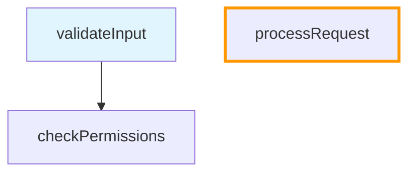

# CodePath 功能特性总结

本文档总结了 CodePath 扩展的所有主要功能特性。

## 📋 目录

- [核心功能](#核心功能)
- [智能位置追踪](#智能位置追踪)
- [树分叉功能](#树分叉功能)
- [节点编辑和验证](#节点编辑和验证)
- [图表管理](#图表管理)
- [文件浏览器集成](#文件浏览器集成)
- [可视化功能](#可视化功能)
- [用户界面](#用户界面)

---

## 核心功能

### 交互式节点创建
- **右键菜单集成**: 选中代码后右键创建节点
- **自动信息捕获**: 自动捕获文件路径、行号、代码片段
- **层次关系**: 支持创建根节点、子节点、父节点
- **快捷键支持**: 
  - `Ctrl+Alt+N` - 新建根节点
  - `Ctrl+Alt+C` - 新建子节点
  - `Ctrl+Alt+P` - 新建父节点

### 智能导航
- **模糊匹配**: 输入部分节点名称快速定位
- **位置匹配**: 使用 `filename:line` 格式精确定位
- **一键跳转**: 点击节点自动打开文件并定位到代码行
- **快捷键**: `Ctrl+Alt+S` - 切换当前节点

---

## 智能位置追踪

### 自动检测位置变化
当代码位置发生变化时，系统会自动检测并提示用户更新。

**工作流程**:
```
代码移动 → 点击节点 → 自动检测 → 显示提示 → 用户确认 → 自动更新 → 预览刷新
```

### 多层搜索策略

1. **精确匹配** (confidence: exact)
   - 使用 SHA-256 代码哈希
   - 最可靠的匹配方式

2. **邻近搜索** (confidence: high/medium)
   - 在原位置 ±20 行范围内搜索
   - 处理代码轻微移动

3. **全文搜索** (confidence: medium/low)
   - 搜索整个文件
   - 处理代码大幅移动

4. **模糊匹配** (confidence: low)
   - 使用 Levenshtein 距离算法
   - 处理代码被修改的情况

### 置信度级别

| 级别 | 说明 | 条件 |
|------|------|------|
| exact | 精确匹配 | 代码哈希完全相同 |
| high | 高置信度 | 相似度>95% 或 距离≤5行 |
| medium | 中等置信度 | 相似度>85% 或 距离≤10行 |
| low | 低置信度 | 相似度>80% |
| failed | 未找到匹配 | 所有策略都失败 |

### 用户交互

**提示消息**:
```
⚠️ Code location may have changed: Code found at line 124 (moved 2 lines)
[OK] [Dismiss]
```

- **OK**: 自动更新节点位置、行号、代码片段，预览立即刷新
- **Dismiss**: 保持原位置，不做任何更改

### 技术特性

- **代码指纹**: SHA-256 哈希生成唯一标识
- **即时刷新**: 更新后预览立即刷新，无需手动操作
- **容错导航**: 即使验证失败也能导航到原始位置
- **自动同步**: 更新 code snippet 时自动更新 codeHash

---

## 树分叉功能

### 功能描述
当向已有父节点的节点添加新父节点时，系统自动创建树分叉，保留原有关系并创建新分支。

### 使用场景

**场景 1: 追踪多条调用路径**
```
同一个函数被不同地方调用:
├─ caller1 → myFunction → ...
└─ caller2 → myFunction → ...
```

**场景 2: 探索不同执行场景**
```
同一段代码在不同条件下执行:
├─ condition1 → codeBlock → ...
└─ condition2 → codeBlock → ...
```

### 工作原理

**修改前**:
```
root → child → grandchild
```

**为 child 添加新父节点 newParent**:
```
├─ newParent → child(副本) → grandchild
└─ root → child(原节点)
```

### 关键特性

- ✅ 自动检测是否需要创建分叉
- ✅ 原有父子关系完整保留
- ✅ 创建节点副本到新分支
- ✅ 所有子孙节点转移到新分支
- ✅ 两个分支可以独立管理

### 技术实现

1. 检测子节点是否已有父节点
2. 生成新的节点 ID
3. 创建子节点的完整副本
4. 将原节点的所有子节点转移到副本
5. 建立新的父子关系
6. 清空原节点的子节点列表

---

## 节点编辑和验证

### 编辑功能

**可编辑字段**:
- 节点名称
- 文件路径
- 行号
- 代码片段
- 描述信息（支持多行）

**编辑流程**:
```
点击节点 → Edit Node → 修改信息 → 保存 → 自动验证 → 预览更新
```

### 描述支持

- **多行描述**: 支持换行的长描述
- **格式显示**: 描述以灰色斜体显示
- **不影响功能**: 描述仅用于说明，不影响节点功能

### 自动验证

**保存后自动执行**:
1. 重新获取最新图数据
2. 使用 LocationTracker 验证位置
3. 根据验证结果更新警告状态
4. 刷新预览显示

**验证结果**:
- ✅ 验证通过: 清除 ⚠️ 警告标记
- ❌ 验证失败: 添加或更新 ⚠️ 警告标记

### 即时预览更新

- 保存后预览立即刷新
- 无需手动切换节点
- 警告状态实时更新
- 使用最新数据验证

### 容错机制

**带警告节点的处理**:
- 点击 ⚠️ 节点仍可导航
- 导航到原始存储位置
- 显示友好的警告消息
- 提供 "Edit Node" 快捷按钮

---

## 图表管理

### 创建和切换

**创建新图表**:
- 状态栏菜单 → "新建 CodePath"
- 命令面板 → "CodePath: Create New CodePath"
- 自动切换到新图表
- 自动更新预览和状态栏

**切换图表**:
- 状态栏菜单 → "切换 CodePath"
- 快捷键: `Ctrl+Shift+G`
- 显示所有可用图表列表
- 预览自动更新

### 导出功能

**方式 1: 状态栏菜单**
```
状态栏 → 导出 CodePath → 选择位置 → 生成 Markdown
```

**方式 2: 预览面板**
```
预览面板 → 📤 Export 按钮 → 选择位置 → 生成 Markdown
```

**方式 3: 文件浏览器**
```
右键 .codepath/*.json → 分享 CodePath → 文件复制到剪贴板
```

### 导入功能

**导入流程**:
```
选择 .md 文件 → 导入数据 → 自动切换 → 打开预览 → 导航到当前节点
```

**自动操作**:
- ✅ 自动切换到新图表
- ✅ 自动打开预览面板
- ✅ 自动导航到当前节点位置
- ✅ 自动打开对应文件

**容错处理**:
- 文件不存在: 显示友好提示，图表仍可用
- 导入失败: 显示错误消息，不影响现有图表

### 删除功能

- 状态栏菜单 → "删除 CodePath"
- 显示确认对话框
- 永久删除图表文件
- 不可撤销操作

---

## 文件浏览器集成

### 预览功能

**使用方式**:
```
文件浏览器 → 右键 .codepath/*.json → "预览 CodePath"
```

**自动操作**:
- 读取 JSON 文件
- 自动切换到该图表
- 打开预览面板
- 显示成功消息

### 分享功能

**使用方式**:
```
文件浏览器 → 右键 .codepath/*.json → "分享 CodePath"
```

**平台支持**:

| 平台 | 行为 | 说明 |
|------|------|------|
| Windows | 复制文件到剪贴板 | 可直接粘贴到聊天工具或文件夹 |
| macOS | 复制文件到剪贴板 | 可直接粘贴到聊天工具或文件夹 |
| Linux | 复制文件路径 | 系统限制，只能复制路径 |

**通知消息**:
```
✅ 文件已复制到剪贴板！
📁 graph_xxx.json

您可以直接粘贴（Ctrl+V）到聊天工具或文件夹中分享。
```

### 右键菜单

**文件浏览器上下文菜单**:
```
右键 .codepath/*.json 文件:
├─ 预览 CodePath  ✨
├─ 分享 CodePath  ✨
├─ Open
├─ Copy
└─ ...
```

---

## 可视化功能

### 文本视图

**特性**:
- 清晰的树状层次结构
- 简化文件名显示（只显示文件名）
- 当前节点标记 `[当前]`
- 位置警告标记 `⚠️`
- 描述信息灰色斜体显示
- 支持多行描述

**示例**:
```
📁 我的代码路径图表 (3 个节点)
├── 🔵 validateInput (auth.ts:15) [当前]
│   │   <用户输入验证函数>
│   └── 🔵 checkPermissions (auth.ts:25)
└── ⚠️ processRequest (api.ts:10)
    │   <位置可能已变化>
```

### Mermaid 图表视图

**特性**:
- 可视化流程图
- 当前节点高亮（浅蓝色背景）
- 警告节点橙色边框
- 清晰的节点关系箭头
- 自动布局优化

**示例**:


### 格式切换

- 快捷键: `Ctrl+Shift+T`
- 状态栏菜单 → "切换视图格式"
- 预览面板 → "Toggle Format" 按钮
- 即时切换，无延迟

---

## 用户界面

### 状态栏快捷菜单

**显示内容**:
- 有图表: `$(graph) 图表名称 (节点数)`
- 无图表: `$(graph) 无图表`

**可用操作**:
- 🆕 新建 CodePath
- 🔄 切换 CodePath
- 📤 导出 CodePath
- 📥 导入 CodePath
- 🗑️ 删除 CodePath
- 🔄 刷新预览
- 🎯 切换节点
- 👁️ 切换视图格式

**优势**:
- 一键访问所有功能
- 无需记忆命令
- 实时显示状态信息
- 友好的图标和说明

### 预览面板工具栏

**按钮布局**:
```
[Toggle Format] [Refresh] [📤 Export] [🗑️ Delete Node] [🗑️ Delete Node & Children] [TEXT]
```

**按钮说明**:
- **Toggle Format**: 切换文本/图表视图
- **Refresh**: 刷新预览
- **📤 Export**: 导出当前图表
- **🗑️ Delete Node**: 删除当前节点
- **🗑️ Delete Node & Children**: 删除节点及子节点
- **TEXT**: 当前视图格式指示器

### 命令面板

**所有命令**:
- `CodePath: Create New CodePath`
- `CodePath: Switch CodePath`
- `CodePath: Export CodePath`
- `CodePath: Import CodePath`
- `CodePath: Delete CodePath`
- `CodePath: New Node`
- `CodePath: New Child Node`
- `CodePath: New Parent Node`
- `CodePath: Switch Current Node`
- `CodePath: Delete Current Node`
- `CodePath: Delete Current Node and Children`
- `CodePath: Open CodePath Panel`
- `CodePath: Refresh Preview`
- `CodePath: Toggle Preview Format`
- `CodePath: Validate Node Locations`
- `CodePath: Relocate Node`

### 右键菜单

**编辑器上下文菜单**:
- New Node (选中代码时)
- New Child Node (有当前节点时)
- New Parent Node (有当前节点时)

**文件浏览器上下文菜单**:
- 预览 CodePath (.codepath/*.json 文件)
- 分享 CodePath (.codepath/*.json 文件)

---

## 配置选项

### 可用设置

```json
{
  "codepath.defaultView": "text",              // 默认视图: "text" 或 "mermaid"
  "codepath.autoSave": true,                   // 启用自动保存
  "codepath.autoLoadLastGraph": true,          // 启动时加载上次图表
  "codepath.previewRefreshInterval": 1000,     // 预览刷新间隔(毫秒)
  "codepath.maxNodesPerGraph": 100             // 每个图表最大节点数
}
```

### 访问设置

1. 打开 VS Code 设置 (`Ctrl+,`)
2. 搜索 "CodePath"
3. 修改相应设置

---

## 性能特性

### 推荐限制
- 每个图表: 100 个节点
- 测试上限: 200 个节点
- 预览超时: 5 秒

### 内存使用
- 基础扩展: ~10MB
- 100 节点图表: ~25MB
- 增长率: ~150KB/节点

### 操作性能
- 节点创建: ~50ms
- 图表切换: ~100ms
- 预览更新: ~200ms (文本), ~500ms (图表)
- 导出/导入: ~1s (中等图表)

---

## 存储和持久化

### 存储位置
- 工作区目录: `.codepath/`
- 图表文件: `.codepath/graph_*.json`
- 备份文件: `.codepath/backup/`

### 文件格式
- JSON 格式存储
- Git 友好
- 人类可读
- 易于版本控制

### 自动备份
- 每 5 分钟自动备份
- 保留最近 5 个备份
- 自动恢复损坏文件

---

## 跨平台支持

### 支持的平台
- ✅ Windows
- ✅ macOS
- ✅ Linux

### 平台特定功能

| 功能 | Windows | macOS | Linux |
|------|---------|-------|-------|
| 基础功能 | ✅ | ✅ | ✅ |
| 文件分享 | 复制文件 | 复制文件 | 复制路径 |
| 快捷键 | Ctrl | Cmd | Ctrl |
| 文件路径 | 反斜杠 | 斜杠 | 斜杠 |

---

## 总结

CodePath 提供了一套完整的代码执行路径追踪解决方案，包括：

✅ **智能追踪**: 自动检测和更新代码位置
✅ **灵活管理**: 多图表、树分叉、节点编辑
✅ **便捷操作**: 状态栏菜单、文件浏览器集成
✅ **团队协作**: 导出/导入、文件分享
✅ **可视化**: 文本和图表双重视图
✅ **跨平台**: 全平台兼容

**适用场景**:
- 调试复杂逻辑
- 代码审查
- 编写文档
- 学习代码
- 代码重构
- 多场景探索

**开始使用**: 选择代码 → 右键 → New Node → 开始追踪！

---

**文档版本**: v1.0
**最后更新**: 2025-10-04
