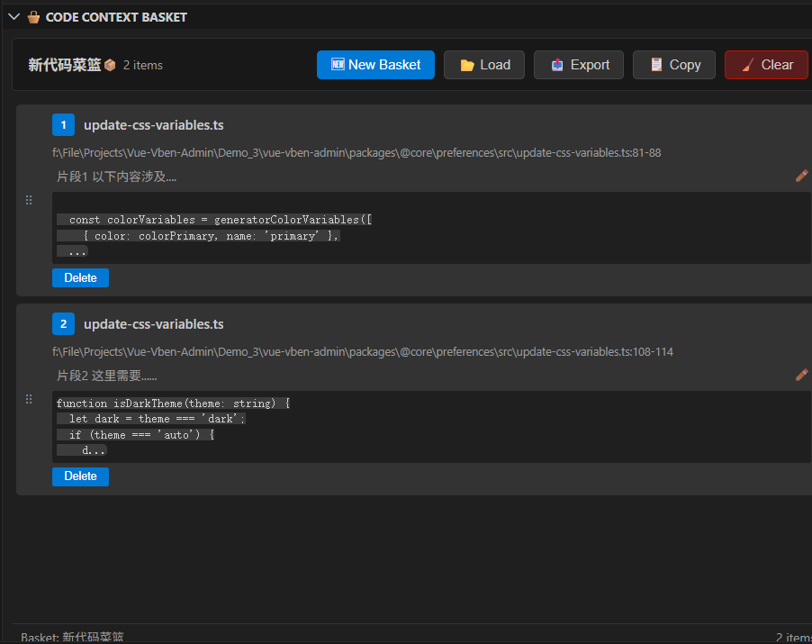

# Code Path Marker - Visual Code Execution Path Marker

<div align="center">

[](package.json)
[](#中文)
[](LICENSE)

**[📖 中文文档](#中文) | [📖 English Documentation](#english) | [🌐 Interactive Docs](docs/index.html) | [GitHub](https://github.com/Nita121388/vscode-codepath)**

---

</div>

## 中文

### 🎯 30 秒快速理解

> **Code Path Marker** 让你用"书签"的方式标记代码路径。选择代码 → 右键标记 → 生成可视化树形图 → 一键分享团队

<div align="center">
  <!-- [截图占位] 核心工作流演示 GIF (quick-start-workflow.gif) -->
  <!-- 展示：代码选中 → 右键菜单 → 树形视图生成 -->
  
</div>

---

### 💡 解决的问题

在阅读复杂代码时，你是否遇到过这些困扰？

| 问题 | 传统方式 | Code Path Marker |
|------|---------|-----------------|
| **代码上下文散乱** | 多个文件间不断跳转 | 统一树形视图展示完整流程 |
| **执行路径不清晰** | 全局搜索、手动追踪 | 可视化节点链，智能位置追踪 |
| **难以记录分享** | 截图+文字描述低效 | 导出 JSON 文件，团队直接导入 |
| **重构后失效** | 重新寻找节点位置 | 自动追踪代码位置，智能更新 |

---

### 🎯 功能分层概览

#### 🔥 核心功能（开箱即用）

| 功能 | 说明 | 快捷键 |
|------|------|--------|
| **可视化执行路径** | 用树形结构展示代码调用链 | - |
| **智能位置追踪** | 代码重构后自动更新节点位置 | `Ctrl+Shift+R` |
| **快速节点标记** | 父/子/兄弟节点一键标记 | `Ctrl+Alt+N/C/P/B` |
| **多图表管理** | 同一项目维护多条代码路径 | `Ctrl+Shift+G` |
| **团队协作分享** | 一键导出/导入 `.codepath` 文件 | - |

> **典型工作流**：选择代码 → 右键 `Code Path` → `🪧 Mark as Node` → 继续标记其他节点 → 自动生成树形视图

---

#### 🤖 AI 时代特色功能

为现代 AI 辅助开发设计的功能，让代码上下文轻松共享给 ChatGPT/Claude/Cursor：

| 功能 | 说明 | 应用场景 |
|------|------|--------|
| **🧺 Code Context Basket** | 批量收集代码片段，一键导出 Markdown | 收集散落代码 → 喂给 AI 理解全流程 |
| **💡 Lightbulb 快捷复制** | 编辑器灯泡菜单一键复制代码上下文（文件路径+行号+代码） | 复制代码片段 + 上下文直接提问 AI |

<details>
<summary><b>AI 工作流示例</b></summary>

```
1️⃣  在 VS Code 中选择需要理解的复杂代码段
2️⃣  点击编辑器灯泡菜单 → "📋 Copy Code Context"
3️⃣  粘贴到 ChatGPT/Claude：
    "请分析这段代码的执行流程：
    [自动复制的文件路径+行号+代码]"
4️⃣  或使用 Code Context Basket 收集多个片段：
    - 🧺 Add 多个代码片段
    - 🧺 Open 查看篮子
    - Copy Markdown → 一次性粂给 AI 分析完整流程
5️⃣  基于 AI 反馈，用 Code Path Marker 标记关键节点
```
</details>

> **AI 增强开发 = Code Path Marker 标记 + 代码上下文复制 + AI 工具理解**

---

#### 🔧 高级特性（深度用户）

<details>
<summary><b>点击展开高级功能</b></summary>

| 功能 | 说明 |
|------|------|
| **树分叉支持** | 同一代码的多条执行路径并存，追踪 A/B 场景 |
| **节点复制/粘贴** | 复用已有节点路径，快速构建新的执行图 |
| **自定义排序** | 拖拽或快捷键调整节点显示顺序 |
| **模糊搜索导航** | `Ctrl+Alt+S` 快速定位任意节点 |
| **文件备份管理** | 批量备份文件/文件夹至 `.codepath/file-backups`，一键恢复 |
| **预览面板自定义菜单** | 右键菜单完全可控，替代浏览器默认操作 |
| **代码指纹验证** | SHA-256 代码哈希，精确检测代码变化 |
| **多策略位置匹配** | 精确/邻近/全文/模糊搜索，最大化找回迁移代码 |

</details>

---

#### 🛠️ 编辑工具

| 工具 | 说明 |
|------|------|
| **行内容弹窗编辑** | 弹窗编辑器自动换行，无需滚动即可查看长代码 |

---

### 🚀 快速开始

#### 📦 安装

1. **从 VS Code 插件市场**（推荐）：
   - 打开 VS Code → 扩展面板（`Ctrl+Shift+X`）
   - 搜索 "Code Path Marker"
   - 点击 **安装** 并重新加载

2. **从命令行**：
   ```bash
   code --install-extension Nita.codepath-extension
   ```

#### ⚡ 3 步快速上手

**步骤 1：创建第一个节点**
```
1. 选中任意代码片段
2. 右键 → "Code Path" → "🪧 Mark as New Node"
3. 自动创建根节点，打开预览面板
```

**步骤 2：构建执行链**
```
1. 选中下一段代码（或函数定义）
2. 右键 → "Code Path" → 选择：
   - "🪧 Mark as Child Node" （子节点）
   - "🪧 Mark as Parent Node" （父节点）
   - "🪧 Mark as Bro Node" （兄弟节点）
3. 重复标记，逐步完善执行路径
```

**步骤 3：查看与分享**
```
1. 预览面板显示实时树形结构
2. 点击树中节点 → 自动跳转至代码位置
3. 右键 → "导出" → 获得 .codepath 文件
4. 分享文件给团队，他们导入即可查看
```

#### 📌 实际场景示例

**场景：理清一个 HTTP 请求处理流程**

```typescript
// src/routes/userRoutes.ts - 第 15 行
router.post('/api/users', createUser);  // 👈 第 1 步：选中，"Mark as New Node"

// src/controllers/userController.ts - 第 23 行
export async function createUser(req, res) {  // 👈 第 2 步："Mark as Child Node"
  const userData = await validateUserData(req.body);
  const user = await userService.createUser(userData);  // 👈 第 3 步："Mark as Child Node"
  res.json(user);
}

// src/services/userService.ts - 第 45 行
export async function createUser(data) {  // 👈 第 4 步："Mark as Child Node"
  const hashedPassword = await hashPassword(data.password);  // 👈 第 5 步："Mark as Child Node"
  return await db.users.create({ ...data, password: hashedPassword });
}

// src/utils/crypto.ts - 第 12 行
export async function hashPassword(password) {  // 👈 第 6 步："Mark as Child Node"
  return bcrypt.hash(password, 10);  // 👈 第 7 步："Mark as Child Node"
}
```

**生成的可视化路径：**
```
🌲 User Registration Flow (用户注册流程)
├─ 📍 POST /api/users (userRoutes.ts:15)
│  └─ 📍 createUser 控制器 (userController.ts:23)
│     └─ 📍 validateUserData 验证 (userController.ts:24)
│     └─ 📍 userService.createUser 服务 (userController.ts:26)
│        └─ 📍 hashPassword 加密 (userService.ts:45)
│           └─ 📍 bcrypt.hash 哈希 (crypto.ts:12)
└─ 📍 数据库保存 (userService.ts:47)
```

**效果**：
- ✅ 从路由 → 控制器 → 服务 → 工具函数的完整链一目了然
- ✅ 每个节点都带上文件和行号，直接跳转修改
- ✅ 代码重构后自动更新位置，置信度提示帮助你评估可靠性
- ✅ 导出分享给团队：_"这是用户注册的完整流程"_

#### 🧺 Code Context Basket（代码上下文篮子）- AI 友好

用于批量收集代码片段，特别适合需要提问 AI 的场景：

| 操作 | 说明 | 快捷键 |
|------|------|--------|
| **🧺 Add** | 捕获当前选中代码（文件路径+行号范围+代码） | `Ctrl+Shift+A` |
| **🧺 Clear And Add** | 清空篮子，重新写入最新选区 | - |
| **🧺 Open** | 打开篮子侧边栏，支持拖拽排序、编辑备注 | - |
| **Copy** | 一键复制篮子内所有代码为 Markdown（含文件路径） | 工具栏按钮 |

<p align="center">
  
</p>

**典型用法**：
```
1. 在代码各处 🧺 Add，收集理解流程所需的所有片段
2. 🧺 Open 查看篮子，按逻辑顺序调整
3. 点击 Copy → 粘贴到 ChatGPT：
   "请分析这段代码流程：[粘贴的 Markdown]"
```

---

### 🎯 典型使用场景

#### 场景 1：调试复杂逻辑
**困扰**：函数链很长，某处报错但不知道从哪开始追踪
**解决**：
- 选中出错函数 → Mark as Node
- 逐级往上标记调用栈 → 生成完整的执行链
- 点击树中节点快速跳转，逐行调试

#### 场景 2：代码审查与交接
**困扰**：新成员需要理解模块代码，只能口头解释
**解决**：
- 标记关键代码路径 → 导出 `.codepath` 文件
- 新成员导入 → 直接查看结构化的执行流程
- 团队讨论时：_"我们在树的第 3 层"_ （更清晰）

#### 场景 3：配合 AI 工具开发
**困扰**：向 AI 解释代码流程很费力，信息碎片化
**解决**：
- 🧺 Code Context Basket 收集关键代码片段
- Copy Markdown → 粘贴到 ChatGPT/Claude
- AI 理解完整流程后，生成文档/重构建议

#### 场景 4：代码重构追踪
**困扰**：重构后之前的笔记位置全部失效，很烦人
**解决**：
- 之前的节点标记自动追踪（通过代码哈希+多策略搜索）
- 重构后 `Ctrl+Shift+R` 刷新 → 自动更新到新位置
- 置信度提示（精确/高/中/低）帮你评估更新的可靠性

#### 场景 5：多条执行路径探索
**困扰**：一段代码有多种调用方式，想记录 A 方案和 B 方案的差异
**解决**：
- 对同一个父节点，标记多个子节点（树分叉）
- 树中自动展示多条路径
- 方便对比分析

---

### 📖 完整文档

| 文档 | 说明 |
|------|------|
| **[📚 用户指南](docs/README-ZH.md)** | 详细功能说明与工作流 |
| **[🛠️ 开发指南](docs/CONTRIBUTING-ZH.md)** | 贡献代码、提交 Issue 指南 |
| **[📋 API 参考](docs/API-ZH.md)** | 命令与扩展接口文档 |
| **[🔧 配置参考](docs/CONFIGURATION-ZH.md)** | 所有配置项详解 |
| **[🎓 学习指南](docs/LEARNING-GUIDE.md)** | 初学者深度学习路线 |
| **[🌐 交互式文档](docs/index.html)** | 在线多语言文档门户 |

---

### ❓ 常见问题速览

<details>
<summary><b>Q: 如何与团队共享代码路径？</b></summary>

A:
1. 右键预览面板 → "导出" → 获得 `.codepath.{id}.json` 文件
2. 将文件放入项目目录或分享给同事
3. 同事导入后，自动切换到该路径并定位至当前节点
4. 支持 Git 版本控制，团队可追踪路径变更历史
</details>

<details>
<summary><b>Q: 代码移动/重构后节点位置会失效吗？</b></summary>

A:
不会。Code Path Marker 使用多策略定位：
1. **代码指纹**：SHA-256 哈希对比（不怕行号变化）
2. **邻近搜索**：±10 行范围内查找
3. **全文搜索**：遍历整个文件
4. **模糊匹配**：相似度算法

刷新时会给出置信度提示（精确/高/中/低），帮你判断更新是否可靠。
</details>

<details>
<summary><b>Q: 支持多个图表吗？</b></summary>

A:
支持。同一项目可维护多个 Code Path（比如不同模块的执行流程）。
- 状态栏菜单快速切换：`Ctrl+Shift+G`
- 每个图表独立保存，互不影响
</details>

<details>
<summary><b>Q: 如何用来配合 AI 工具？</b></summary>

A:
2 种方式：
1. **手动方式**：复制代码上下文 → 粘贴到 ChatGPT/Claude
2. **篮子方式**：批量收集代码 → `Copy` Markdown → 喂给 AI
</details>

<details>
<summary><b>Q: 对 VS Code 版本有要求吗？</b></summary>

A:
需要 VS Code ≥ 1.74.0。建议使用最新版本以获得最佳体验。
</details>

---

### 🌟 项目信息

| 项 | 值 |
|----|-----|
| **版本** | 0.2.9 |
| **发布者** | Nita |
| **许可** | MIT |
| **最低 VS Code** | 1.74.0+ |
| **GitHub** | [vscode-codepath](https://github.com/Nita121388/vscode-codepath) |
| **主页** | [codepath-extension](https://github.com/Nita121388/vscode-codepath#readme) |

---

## 🎨 VibeCoding 开发声明

本项目采用 **VibeCoding** 工作流，由人与 AI 协同共创完成。我们强调：

- **沉浸式节奏**：保持开发的流畅感与创意连贯性
- **即时反馈**：通过 AI 工具快速验证想法和实现方案
- **人机协作**：充分发挥人类的架构思维与 AI 的生产力

代码、文档与测试均在这种协作环境下迭代生成。我们认为这是**现代高效开发**的新常态，而非传统"古法手敲"模式。

请在贡献或审阅本项目时，充分考虑这一创作背景。我们欢迎各种形式的贡献，无论是代码、建议还是 AI 辅助的方案。

---

## English

### 🎯 30-Second Quick Overview

> **Code Path Marker** lets you bookmark code paths like bookmarks. Select code → Right-click mark → Generate visual tree → Share with team instantly

<div align="center">
  <!-- [Screenshot Placeholder] Core Workflow Demo GIF (quick-start-workflow.gif) -->
  <!-- Shows: Code selection → Right-click menu → Tree view generation -->
  
</div>

---

### 💡 The Problem

Have you encountered these challenges while reading complex code?

| Problem | Traditional Way | Code Path Marker |
|---------|-----------------|-----------------|
| **Scattered Code Context** | Jump between multiple files | Unified tree view showing complete flow |
| **Unclear Execution Paths** | Global search, manual tracking | Visual node chain with smart tracking |
| **Hard to Record & Share** | Screenshots + text (inefficient) | Export JSON, team imports directly |
| **Lost After Refactoring** | Search locations again | Auto-track code, intelligent updates |

---

### 🎯 Feature Overview by Layer

#### 🔥 Core Features (Ready to Use)

| Feature | Description | Shortcut |
|---------|-------------|----------|
| **Visualize Execution Paths** | Show code call chains in tree structure | - |
| **Smart Location Tracking** | Auto-update node positions after refactoring | `Ctrl+Shift+R` |
| **Quick Node Marking** | Mark parent/child/sibling nodes instantly | `Ctrl+Alt+N/C/P/B` |
| **Multi-Graph Management** | Maintain multiple code paths in one project | `Ctrl+Shift+G` |
| **Team Collaboration** | Export/Import `.codepath` files instantly | - |

> **Typical Workflow**: Select code → Right-click `Code Path` → `🪧 Mark as Node` → Continue marking → Auto-generate tree

---

#### 🤖 AI-Era Special Features

Designed for modern AI-assisted development, easily share code context with ChatGPT/Claude/Cursor:

| Feature | Description | Use Case |
|---------|-------------|----------|
| **🧺 Code Context Basket** | Batch collect code snippets, export Markdown | Gather scattered code → Feed to AI for full flow understanding |
| **💡 Lightbulb Quick Copy** | Editor lightbulb menu one-click copy code context (file path+line+code) | Copy snippets + context directly ask AI |

<details>
<summary><b>AI Workflow Example</b></summary>

```
1️⃣  Select complex code in VS Code you want to understand
2️⃣  Click editor lightbulb menu → "📋 Copy Code Context"
3️⃣  Paste to ChatGPT/Claude:
    "Please analyze this code execution flow:
    [Auto-copied file path + line numbers + code]"
4️⃣  Or use Code Context Basket to collect multiple snippets:
    - 🧺 Add multiple code snippets
    - 🧺 Open basket
    - Copy Markdown → Feed AI to analyze complete flow at once
5️⃣  Based on AI feedback, mark key nodes with Code Path Marker
```
</details>

> **AI-Enhanced Development = Code Path Marker + Context Copy + AI Tools**

---

#### 🔧 Advanced Features (Power Users)

<details>
<summary><b>Click to expand advanced features</b></summary>

| Feature | Description |
|---------|-------------|
| **Tree Fork Support** | Multiple execution paths coexist for A/B scenario tracking |
| **Node Copy/Paste** | Reuse existing node paths, quickly build new execution graphs |
| **Custom Ordering** | Drag or hotkey to adjust node display order |
| **Fuzzy Search Navigation** | `Ctrl+Alt+S` quick locate any node |
| **File Backup Management** | Batch backup files/folders to `.codepath/file-backups`, one-click restore |
| **Custom Preview Menu** | Right-click menu fully controllable, replace browser defaults |
| **Code Fingerprint Verification** | SHA-256 code hash, precisely detect code changes |
| **Multi-Strategy Location Matching** | Exact/nearby/full-text/fuzzy search maximizes finding relocated code |

</details>

---

#### 🛠️ Editing Tools

| Tool | Description |
|------|-------------|
| **Line Content Popup Editor** | Popup editor with auto-wrap, view long lines without scrolling |

---

### 🚀 Quick Start

#### 📦 Installation

1. **From VS Code Marketplace** (Recommended):
   - Open VS Code → Extensions panel (`Ctrl+Shift+X`)
   - Search for "Code Path Marker"
   - Click **Install** and reload

2. **From Command Line**:
   ```bash
   code --install-extension Nita.codepath-extension
   ```

#### ⚡ 3 Steps to Get Started

**Step 1: Create Your First Node**
```
1. Select any code snippet
2. Right-click → "Code Path" → "🪧 Mark as New Node"
3. Auto-creates root node and opens preview panel
```

**Step 2: Build Execution Chain**
```
1. Select next code segment or function definition
2. Right-click → "Code Path" → Choose:
   - "🪧 Mark as Child Node" (child)
   - "🪧 Mark as Parent Node" (parent)
   - "🪧 Mark as Bro Node" (sibling)
3. Repeat marking, progressively complete your path
```

**Step 3: View & Share**
```
1. Preview panel displays real-time tree structure
2. Click any node → Auto-jump to code location
3. Right-click → "Export" → Get .codepath file
4. Share file with team, they import to view instantly
```

#### 📌 Real-World Example

**Scenario: Understanding an HTTP Request Flow**

```typescript
// src/routes/userRoutes.ts - Line 15
router.post('/api/users', createUser);  // 👈 Step 1: Select, "Mark as New Node"

// src/controllers/userController.ts - Line 23
export async function createUser(req, res) {  // 👈 Step 2: "Mark as Child Node"
  const userData = await validateUserData(req.body);
  const user = await userService.createUser(userData);  // 👈 Step 3: "Mark as Child Node"
  res.json(user);
}

// src/services/userService.ts - Line 45
export async function createUser(data) {  // 👈 Step 4: "Mark as Child Node"
  const hashedPassword = await hashPassword(data.password);  // 👈 Step 5: "Mark as Child Node"
  return await db.users.create({ ...data, password: hashedPassword });
}

// src/utils/crypto.ts - Line 12
export async function hashPassword(password) {  // 👈 Step 6: "Mark as Child Node"
  return bcrypt.hash(password, 10);  // 👈 Step 7: "Mark as Child Node"
}
```

**Generated Visual Path:**
```
🌲 User Registration Flow
├─ 📍 POST /api/users (userRoutes.ts:15)
│  └─ 📍 createUser controller (userController.ts:23)
│     └─ 📍 validateUserData validation (userController.ts:24)
│     └─ 📍 userService.createUser service (userController.ts:26)
│        └─ 📍 hashPassword encryption (userService.ts:45)
│           └─ 📍 bcrypt.hash hashing (crypto.ts:12)
└─ 📍 Database save (userService.ts:47)
```

**Benefits:**
- ✅ Complete chain from route → controller → service → utility function at a glance
- ✅ Each node has file and line number, jump directly to edit
- ✅ After refactoring, auto-update positions with confidence hints
- ✅ Export share with team: _"This is the complete user registration flow"_

#### 🧺 Code Context Basket - AI Friendly

Batch collect code snippets, especially useful when asking AI questions:

| Action | Description | Shortcut |
|--------|-------------|----------|
| **🧺 Add** | Capture current selection (file path+line range+code) | `Ctrl+Shift+A` |
| **🧺 Clear And Add** | Clear basket, write latest selection | - |
| **🧺 Open** | Open basket sidebar, drag to reorder, edit notes | - |
| **Copy** | One-click copy all basket code as Markdown (with file paths) | Toolbar button |

<p align="center">
  
</p>

**Typical Usage:**
```
1. 🧺 Add throughout codebase, collect all snippets needed to understand flow
2. 🧺 Open basket, adjust order logically
3. Click Copy → Paste to ChatGPT:
   "Please analyze this code flow: [Pasted Markdown]"
```

---

### 🎯 Typical Use Cases

#### Scenario 1: Debug Complex Logic
**Challenge**: Long function chain, error at some point but don't know where to start tracing
**Solution**:
- Select error function → Mark as Node
- Gradually mark calling stack upward → Generate complete execution chain
- Click tree nodes to jump quickly, debug line by line

#### Scenario 2: Code Review & Onboarding
**Challenge**: New team member needs to understand module code, only verbal explanation possible
**Solution**:
- Mark key code paths → Export `.codepath` file
- New member imports → View structured execution flow directly
- Team discussions: _"We're at layer 3 in the tree"_ (much clearer)

#### Scenario 3: AI-Assisted Development
**Challenge**: Explaining code flow to AI is tedious, information fragmented
**Solution**:
- 🧺 Code Context Basket collect key snippets
- Copy Markdown → Paste to ChatGPT/Claude
- AI understands complete flow, generates docs/refactor suggestions

#### Scenario 4: Refactoring Tracking
**Challenge**: After refactoring, previous notes' locations all invalid, frustrating
**Solution**:
- Previous node markings auto-track (via code hash + multi-strategy search)
- After refactoring, `Ctrl+Shift+R` refresh → Auto-update to new positions
- Confidence hints (exact/high/medium/low) help evaluate reliability

#### Scenario 5: Multiple Execution Paths
**Challenge**: One code segment has multiple call paths, want to record A plan vs B plan differences
**Solution**:
- Mark multiple children to same parent node (tree fork)
- Tree auto-displays multiple paths
- Easy for comparative analysis

---

### 📖 Complete Documentation

| Documentation | Description |
|---------------|-------------|
| **[📚 User Guide](docs/README-EN.md)** | Detailed features and workflows |
| **[🛠️ Developer Guide](docs/CONTRIBUTING-EN.md)** | Contributing code, issue submission guide |
| **[📋 API Reference](docs/API-EN.md)** | Commands and extension interface docs |
| **[🔧 Configuration Reference](docs/CONFIGURATION-EN.md)** | All configuration options explained |
| **[🎓 Learning Guide](docs/LEARNING-GUIDE-EN.md)** | Beginner learning path |
| **[🌐 Interactive Docs](docs/index.html)** | Online multilingual documentation portal |

---

### ❓ FAQ Quick Look

<details>
<summary><b>Q: How to share code paths with team?</b></summary>

A:
1. Right-click preview panel → "Export" → Get `.codepath.{id}.json` file
2. Put file in project directory or share with colleagues
3. They import, auto-switch to that path and focus on current node
4. Supports Git version control, team can track path changes history
</details>

<details>
<summary><b>Q: Will node positions become invalid if code moves/refactors?</b></summary>

A:
No. Code Path Marker uses multi-strategy location:
1. **Code Fingerprint**: SHA-256 hash comparison (immune to line number changes)
2. **Nearby Search**: Find within ±10 lines range
3. **Full-Text Search**: Traverse entire file
4. **Fuzzy Matching**: Similarity algorithm

On refresh, confidence hints (exact/high/medium/low) help judge if update is reliable.
</details>

<details>
<summary><b>Q: Support multiple graphs?</b></summary>

A:
Yes. One project can maintain multiple Code Paths (e.g., different module execution flows).
- Quick switch from status bar: `Ctrl+Shift+G`
- Each graph saves independently, no conflicts
</details>

<details>
<summary><b>Q: How to use with AI tools?</b></summary>

A:
2 ways:
1. **Manual**: Copy code context → Paste to ChatGPT/Claude
2. **Basket**: Batch collect → `Copy` Markdown → Feed to AI
</details>

<details>
<summary><b>Q: Any VS Code version requirements?</b></summary>

A:
Requires VS Code ≥ 1.74.0. Recommend latest version for best experience.
</details>

---

### 🌟 Project Info

| Item | Value |
|------|-------|
| **Version** | 0.2.9 |
| **Publisher** | Nita |
| **License** | MIT |
| **Min VS Code** | 1.74.0+ |
| **GitHub** | [vscode-codepath](https://github.com/Nita121388/vscode-codepath) |
| **Homepage** | [codepath-extension](https://github.com/Nita121388/vscode-codepath#readme) |

---

## 🎨 VibeCoding Development Statement

This project is built with the **VibeCoding** workflow, co-created by humans and AI. We emphasize:

- **Immersive Rhythm**: Maintain development flow and creative continuity
- **Instant Feedback**: Rapidly validate ideas and implementation through AI tools
- **Human-AI Collaboration**: Leverage human architectural thinking and AI productivity

Code, documentation, and tests are all iteratively generated in this collaborative environment. We believe this is the **new normal of modern efficient development**, rather than the traditional "handcrafted" approach.

When contributing to or reviewing this project, please consider this creative context. We welcome all forms of contributions, whether code, suggestions, or AI-assisted solutions.

---

<div align="center">

### 🌟 Star this project if you find it helpful!

**[Report Issues](https://github.com/Nita121388/vscode-codepath/issues) | [Contribute](CONTRIBUTING.md) | [License](LICENSE) | [GitHub](https://github.com/Nita121388/vscode-codepath)**

</div>
