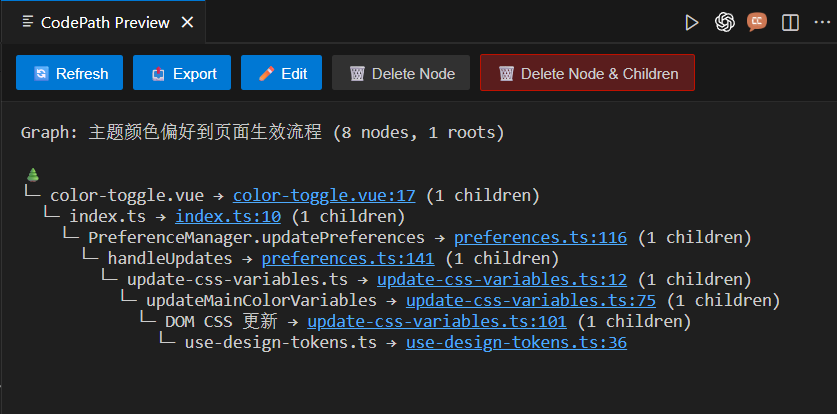

# Code Path Marker - Visual Code Execution Path Marker

<div align="center">

[](#中文)
[](#english)
[](docs/index.html)

**[📖 中文文档](#中文) | [📖 English Documentation](#english) | [🌐 Interactive Docs](docs/index.html)**

---

</div>

## 中文

### 💡 解决的问题

在阅读复杂代码时，你是否遇到过这些困扰？

- 📂 **代码上下文散乱**：一个功能的实现分散在多个文件中，需要不断跳转才能理解完整流程
- 🔍 **执行路径不清晰**：调试时想知道"这个函数是从哪里调用的"，却需要全局搜索、反复跳转
- 📝 **难以记录和分享**：想给同事解释一段复杂逻辑，只能截图+文字描述，效率低下
- 🔄 **代码重构后丢失上下文**：重构后之前记录的位置失效，需要重新寻找

**Code Path Marker 让你像"打书签"一样标记代码路径**：

✅ 随时选择任意**代码片段、文件、文件夹**标记为节点
✅ 通过 **Parent（父节点）、Child（子节点）、Bro（兄弟节点）** 组织代码执行关系
✅ 用**可视化树形视图**直观展示完整执行流程
✅ **自动追踪代码位置**，重构后智能更新节点位置
✅ **导出/导入**功能，轻松与团队分享代码路径

> 将散落在代码中的执行上下文统一到一个视图，让代码阅读和调试变得高效直观。

**注意**：插件当前仍处于测试阶段，功能接口、文档、数据结构可能会频繁调整，欢迎反馈体验问题与改进建议。

<p align="center">
  
</p>

### 🚀 快速开始

#### 📦 安装

1. **从 VS Code 插件市场**（推荐）：
   - 打开 VS Code
   - 进入扩展面板（Ctrl+Shift+X / Cmd+Shift+X）
   - 搜索 "Code Path Marker"
   - 点击 **安装**

2. **从命令行安装**：
   ```bash
   code --install-extension Nita.codepath-extension
   ```

#### 📌 实际场景示例

**场景：理清一个 HTTP 请求处理流程**

```typescript
// src/routes/userRoutes.ts
router.post('/api/users', createUser);  // 👈 1. 选中这行，右键标记为"新根节点"

// src/controllers/userController.ts
export async function createUser(req, res) {  // 👈 2. 选中函数名，标记为"子节点"
  const userData = await validateUserData(req.body);
  const user = await userService.createUser(userData);  // 👈 3. 选中这行，标记为"子节点"
  res.json(user);
}

// src/services/userService.ts
export async function createUser(data) {  // 👈 4. 选中函数名，标记为"子节点"
  const hashedPassword = await hashPassword(data.password);  // 👈 5. 选中调用，标记为"子节点"
  return await db.users.create({ ...data, password: hashedPassword });
}

// src/utils/crypto.ts
export async function hashPassword(password) {  // 👈 6. 选中函数定义，标记为"子节点"
  return bcrypt.hash(password, 10);
}
```

**生成的可视化路径：**
```
🌲 [Graph] 用户注册流程
├─ 📍 POST /api/users (userRoutes.ts:15)
   └─ 📍 createUser 控制器 (userController.ts:23)
      └─ 📍 createUser 服务 (userService.ts:45)
         └─ 📍 hashPassword 加密 (crypto.ts:12)
            └─ 📍 bcrypt.hash 调用 (crypto.ts:13)
```

**效果**：从路由 → 控制器 → 服务 → 工具函数的完整调用链一目了然！

#### ⚡ 快速操作

1. **选择代码** → 在编辑器中高亮任意代码片段
2. **右键菜单** → 选择 "Code Path" → "Mark as New Node"
3. **构建路径** → 继续标记其他代码，选择 Parent/Child/Bro 建立关系
4. **查看视图** → 点击状态栏的 Code Path 图标，查看完整路径树

### 📖 文档

- **[📚 用户指南](docs/README-ZH.md)** - 完整使用说明
- **[🛠️ 开发指南](docs/CONTRIBUTING-ZH.md)** - 开发和贡献指南
- **[📋 API 参考](docs/API-ZH.md)** - 技术 API 文档
- **[🔧 配置说明](docs/CONFIGURATION-ZH.md)** - 设置和自定义
- **[🌐 交互式文档](docs/index.html)** - 多语言文档门户
- **[🎓 学习指南](docs/LEARNING-GUIDE.md)** - 初学者深度指南

### ⚡ 核心功能

- **交互式节点标记** - 统一"Code Path"子菜单快速标记节点
- **文本可视化** - 实时刷新、分层展示的树形视图
- **多图表管理** - 状态栏快捷菜单快速访问
- **行内容编辑弹窗** - 选中代码后通过灯泡菜单或右键菜单打开自动换行的编辑弹窗，支持多行编辑并保留原始行号
- **智能导航** - 模糊匹配和位置追踪
- **自动位置更新** - 智能代码追踪，多策略搜索
- **树分叉支持** - 追踪同一代码的多条执行路径
- **导出/导入** - 团队协作分享，自动切换
- **节点编辑** - 实时验证和预览更新
- **文件浏览器集成** - 标记文件/文件夹为节点，直接预览和分享图表文件
- **节点操作** - 复制、粘贴、剪切、上移、下移，自定义预览菜单
- **代码上下文复制** - 一键复制相对路径、行号范围与代码片段，便于沟通协作
- **跨平台** - 全平台兼容

### 🎯 使用场景

- **调试复杂逻辑** - 可视化执行流程，自动追踪位置变化
- **代码审查** - 通过导出/导入与团队分享执行路径
- **编写文档** - 通过结构化文本记录执行路径
- **学习代码** - 交互式导航理解复杂代码库
- **代码重构** - 智能位置更新追踪代码变化
- **多场景探索** - 使用树分叉探索不同执行路径

---

## English

### 💡 The Problem

Have you encountered these challenges while reading complex code?

- 📂 **Scattered Code Context**: A single feature implementation spread across multiple files, requiring constant jumping to understand the complete flow
- 🔍 **Unclear Execution Paths**: During debugging, wondering "where is this function called from?" requires global searches and repetitive navigation
- 📝 **Difficult to Record and Share**: Explaining complex logic to colleagues requires screenshots + text descriptions, which is inefficient
- 🔄 **Lost Context After Refactoring**: Previously recorded locations become invalid after refactoring, requiring re-discovery

**Code Path Marker lets you bookmark code paths like adding bookmarks**:

✅ Select any **code snippet, file, or folder** anytime to mark as a node
✅ Organize code execution relationships through **Parent, Child, and Bro (sibling) nodes**
✅ Visualize complete execution flow with **interactive tree views**
✅ **Automatically track code locations** with intelligent position updates after refactoring
✅ **Export/Import** functionality to easily share code paths with your team

> Unify scattered execution context from your codebase into a single view, making code reading and debugging efficient and intuitive.

**Note**: The extension is still in beta; its APIs, documentation, and data structures may change frequently. Feedback on issues and suggestions for improvement are welcome.

<p align="center">
  
</p>

### 🚀 Quick Start

#### 📦 Installation

1. **From VS Code Marketplace** (Recommended):
   - Open VS Code
   - Go to Extensions panel (Ctrl+Shift+X / Cmd+Shift+X)
   - Search for "Code Path Marker"
   - Click **Install**

2. **From Command Line**:
   ```bash
   code --install-extension Nita.codepath-extension
   ```

#### 📌 Real-World Example

**Scenario: Understanding an HTTP Request Flow**

```typescript
// src/routes/userRoutes.ts
router.post('/api/users', createUser);  // 👈 1. Select this line, right-click "Mark as New Root Node"

// src/controllers/userController.ts
export async function createUser(req, res) {  // 👈 2. Select function name, mark as "Child Node"
  const userData = await validateUserData(req.body);
  const user = await userService.createUser(userData);  // 👈 3. Select this line, mark as "Child Node"
  res.json(user);
}

// src/services/userService.ts
export async function createUser(data) {  // 👈 4. Select function name, mark as "Child Node"
  const hashedPassword = await hashPassword(data.password);  // 👈 5. Select this call, mark as "Child Node"
  return await db.users.create({ ...data, password: hashedPassword });
}

// src/utils/crypto.ts
export async function hashPassword(password) {  // 👈 6. Select function definition, mark as "Child Node"
  return bcrypt.hash(password, 10);
}
```

**Generated Visual Path:**
```
🌲 [Graph] User Registration Flow
├─ 📍 POST /api/users (userRoutes.ts:15)
   └─ 📍 createUser controller (userController.ts:23)
      └─ 📍 createUser service (userService.ts:45)
         └─ 📍 hashPassword encryption (crypto.ts:12)
            └─ 📍 bcrypt.hash call (crypto.ts:13)
```

**Result**: The complete call chain from route → controller → service → utility function is crystal clear!

#### ⚡ Quick Actions

1. **Select Code** → Highlight any code snippet in your editor
2. **Right-click Menu** → Choose "Code Path" → "Mark as New Node"
3. **Build Path** → Continue marking other code, select Parent/Child/Bro to establish relationships
4. **View Tree** → Click the Code Path icon in the status bar to view the complete path tree

### 📖 Documentation

- **[📚 User Guide](docs/README-EN.md)** - Complete usage instructions
- **[🛠️ Developer Guide](docs/CONTRIBUTING-EN.md)** - Development and contribution guide
- **[📋 API Reference](docs/API-EN.md)** - Technical API documentation
- **[🔧 Configuration](docs/CONFIGURATION-EN.md)** - Settings and customization
- **[🌐 Interactive Docs](docs/index.html)** - Multi-language documentation portal
- **[🎓 Learning Guide](docs/LEARNING-GUIDE-EN.md)** - In-depth guide for beginners

### ⚡ Key Features

- **Interactive Node Marking** from selected code with unified "Code Path" submenu
- **Text Visualization** with instant refresh and hierarchical view
- **Multiple Graph Management** with quick status bar menu
- **Line Content Popup Editor** - Open auto-wrapping editor popup via lightbulb or context menu for multi-line editing with preserved line numbers
- **Lightbulb Quick Actions** - Access both the 🪧 Line Content Popup Editor and 📋 Copy Code Context directly from the editor lightbulb (Quick Fix) menu to quickly edit or copy sharable code context with file paths and line ranges
- **Smart Navigation** with fuzzy matching and location tracking
- **Auto Location Update** - Intelligent code tracking with multi-strategy search
- **Tree Fork Support** - Track multiple execution paths for the same code
- **Export/Import** for team collaboration with auto-switch
- **Node Editing** with real-time validation and preview update
- **File Explorer Integration** - Mark files/folders as nodes, preview and share graphs
- **Node Operations** - Copy, paste, cut, move up/down with custom preview menu
- **Copy Code Context** - Copy relative file paths, line ranges, and selected snippets for quick sharing
- **File & Folder Backup Management** - Quickly back up selected files/folders from the explorer or status bar menu to `.codepath/file-backups`, keep only the latest backup per resource, restore from the latest backup, or clear all backups with one click
- **Cross-platform** compatibility

### 🎯 Use Cases

- **Debug Complex Logic** - Visualize execution flow with automatic location tracking
- **Code Review** - Share execution paths with team via export/import
- **Documentation** - Capture execution flows with structured text export
- **Learning** - Understand complex codebases with interactive navigation
- **Refactoring** - Track code changes with intelligent location updates
- **Multiple Scenarios** - Use tree forks to explore different execution paths

---

<div align="center">

### 🌟 Star this project if you find it helpful!

**[Report Issues](https://github.com/your-org/codepath-extension/issues) | [Contribute](CONTRIBUTING.md) | [License](LICENSE)**

</div>
