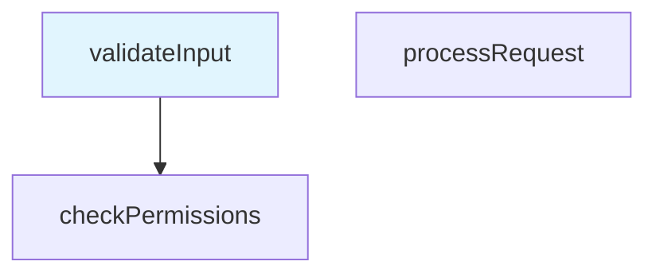

# CodePath API Reference

This document provides API reference information for the CodePath VS Code extension.

## 📚 Table of Contents

- [Core Managers](#core-managers)
- [Data Models](#data-models)
- [Renderers](#renderers)
- [Error Handling](#error-handling)
- [Configuration](#configuration)

## Core Managers

### GraphManager

Manages graph lifecycle operations including creation, loading, saving, and deletion.

#### Constructor

```typescript
constructor(
    storageManager: IStorageManager,
    configManager: IConfigurationManager
)
```

#### Key Methods

##### `createGraph(name?: string): Promise<Graph>`

Creates a new graph with optional name.

**Parameters:**
- `name` (optional): Graph name. If not provided, generates default name.

**Returns:** Promise resolving to the created Graph object.

**Example:**
```typescript
const graph = await graphManager.createGraph('User Authentication Flow');
```

##### `loadGraph(graphId: string): Promise<Graph>`

Loads an existing graph by ID.

**Parameters:**
- `graphId`: Unique identifier of the graph to load.

**Returns:** Promise resolving to the loaded Graph object.

**Throws:** `CodePathError` if graph not found or corrupted.

##### `exportGraph(graph: Graph, format: 'md'): Promise<string>`

Exports a graph to specified format.

**Parameters:**
- `graph`: Graph object to export.
- `format`: Export format (currently only 'md' supported).

**Returns:** Promise resolving to exported content string.

### NodeManager

Manages node creation, relationships, and navigation.

#### Key Methods

##### `createNode(name: string, filePath: string, lineNumber: number, codeSnippet?: string): Promise<Node>`

Creates a new root node.

**Parameters:**
- `name`: Node display name.
- `filePath`: Absolute path to the source file.
- `lineNumber`: Line number in the source file.
- `codeSnippet` (optional): Code snippet associated with the node.

**Returns:** Promise resolving to the created Node object.

**Example:**
```typescript
const node = await nodeManager.createNode(
    'validateInput',
    '/src/auth.ts',
    15,
    'function validateInput(data: any) {'
);
```

##### `createChildNode(parentId: string, name: string, filePath: string, lineNumber: number): Promise<Node>`

Creates a child node under the specified parent.

**Parameters:**
- `parentId`: ID of the parent node.
- `name`: Child node display name.
- `filePath`: Absolute path to the source file.
- `lineNumber`: Line number in the source file.

**Returns:** Promise resolving to the created child Node object.

##### `setCurrentNode(nodeId: string): void`

Sets the current active node.

**Parameters:**
- `nodeId`: ID of the node to set as current.

**Throws:** `CodePathError` if node not found.

### PreviewManager

Manages preview rendering and format switching.

#### Key Methods

##### `renderPreview(): Promise<string>`

Renders the current graph in the selected format.

**Returns:** Promise resolving to rendered content string.

##### `setFormat(format: 'text' | 'mermaid'): void`

Sets the preview format.

**Parameters:**
- `format`: Preview format ('text' or 'mermaid').

##### `getFormat(): 'text' | 'mermaid'`

Gets the current preview format.

**Returns:** Current preview format.

## Data Models

### Graph

Represents a code path graph containing nodes and their relationships.

#### Properties

```typescript
interface Graph {
    /** Unique graph identifier */
    id: string;
    /** Human-readable graph name */
    name: string;
    /** Graph creation timestamp */
    createdAt: Date;
    /** Last modification timestamp */
    updatedAt: Date;
    /** Map of node ID to Node objects */
    nodes: Map<string, Node>;
    /** Array of root node IDs */
    rootNodes: string[];
    /** Currently selected node ID */
    currentNodeId: string | null;
}
```

#### Methods

##### `addNode(node: Node): void`

Adds a node to the graph.

##### `removeNode(nodeId: string): void`

Removes a node and updates relationships.

##### `getNode(nodeId: string): Node | undefined`

Gets a node by ID.

### Node

Represents a single node in the code path graph.

#### Properties

```typescript
interface Node {
    /** Unique node identifier */
    id: string;
    /** Node display name */
    name: string;
    /** Source file path */
    filePath: string;
    /** Line number in source file */
    lineNumber: number;
    /** Optional code snippet */
    codeSnippet?: string;
    /** Node creation timestamp */
    createdAt: Date;
    /** Parent node ID (null for root nodes) */
    parentId: string | null;
    /** Array of child node IDs */
    childIds: string[];
}
```

## Renderers

### TextRenderer

Renders graphs as hierarchical text representations.

#### Methods

##### `render(graph: Graph): string`

Renders the entire graph as text.

**Parameters:**
- `graph`: Graph object to render.

**Returns:** Text representation of the graph.

**Example Output:**
```
📁 My Code Path Graph (3 nodes)
├── 🔵 validateInput (/src/auth.ts:15) [CURRENT]
│   └── 🔵 checkPermissions (/src/auth.ts:25)
└── 🔵 processRequest (/src/api.ts:10)
```

### MermaidRenderer

Renders graphs as Mermaid diagrams.

#### Methods

##### `render(graph: Graph): string`

Renders the graph as a Mermaid diagram.

**Parameters:**
- `graph`: Graph object to render.

**Returns:** Mermaid diagram syntax string.

**Example Output:**


## Error Handling

### CodePathError

Custom error class for CodePath-specific errors.

#### Constructor

```typescript
constructor(
    message: string,
    category: ErrorCategory,
    options?: {
        originalError?: Error;
        userMessage?: string;
        suggestedAction?: string;
        recoverable?: boolean;
    }
)
```

#### Properties

- `category`: Error category ('user', 'filesystem', 'validation', 'rendering')
- `userMessage`: User-friendly error message
- `suggestedAction`: Suggested recovery action
- `recoverable`: Whether the error is recoverable

#### Static Methods

##### `userError(message: string, suggestedAction?: string): CodePathError`

Creates a user input error.

##### `filesystemError(message: string, originalError?: Error): CodePathError`

Creates a file system error.

##### `validationError(message: string): CodePathError`

Creates a validation error.

## Configuration

### Configuration Options

The extension supports the following configuration options:

```typescript
interface Configuration {
    /** Default preview format */
    defaultView: 'text' | 'mermaid';
    /** Enable automatic graph saving */
    autoSave: boolean;
    /** Auto-load last used graph on startup */
    autoLoadLastGraph: boolean;
    /** Preview refresh interval in milliseconds */
    previewRefreshInterval: number;
    /** Maximum nodes per graph */
    maxNodesPerGraph: number;
}
```

### ConfigurationManager

#### Methods

##### `getConfiguration(): Configuration`

Gets the current configuration.

##### `updateConfiguration<K extends keyof Configuration>(key: K, value: Configuration[K]): Promise<void>`

Updates a configuration value.

## Usage Examples

### Basic Node Creation Workflow

```typescript
// Initialize managers
const storageManager = new StorageManager('/workspace');
const configManager = new ConfigurationManager();
const graphManager = new GraphManager(storageManager, configManager);
const nodeManager = new NodeManager(graphManager, configManager);

// Create a graph
const graph = await graphManager.createGraph('Authentication Flow');

// Create root node
const rootNode = await nodeManager.createNode(
    'validateCredentials',
    '/src/auth.ts',
    10,
    'function validateCredentials(username: string, password: string) {'
);

// Create child node
const childNode = await nodeManager.createChildNode(
    rootNode.id,
    'checkDatabase',
    '/src/auth.ts',
    25
);
```

### Preview Rendering

```typescript
const previewManager = new PreviewManager(configManager);

// Set format and render
previewManager.setFormat('mermaid');
const diagramContent = await previewManager.renderPreview();

// Switch to text format
previewManager.setFormat('text');
const textContent = await previewManager.renderPreview();
```

### Error Handling

```typescript
try {
    await nodeManager.createNode('', '/invalid/path', -1);
} catch (error) {
    if (error instanceof CodePathError) {
        console.log('Category:', error.category);
        console.log('User Message:', error.userMessage);
        console.log('Suggested Action:', error.suggestedAction);
        
        if (error.recoverable) {
            // Attempt recovery
        }
    }
}
```

## Best Practices

### Memory Management

- Always dispose of event listeners when components are destroyed
- Use the `dispose()` method on managers to clean up resources
- Avoid holding references to large objects unnecessarily

### Error Handling

- Use `CodePathError` for all extension-specific errors
- Provide helpful user messages and recovery suggestions
- Log detailed error information for debugging

### Performance

- Use debouncing for frequent operations like preview updates
- Implement lazy loading for large graphs
- Monitor memory usage in production

---

*This API documentation is automatically generated from TypeScript interfaces and JSDoc comments. For the most up-to-date information, refer to the source code.*