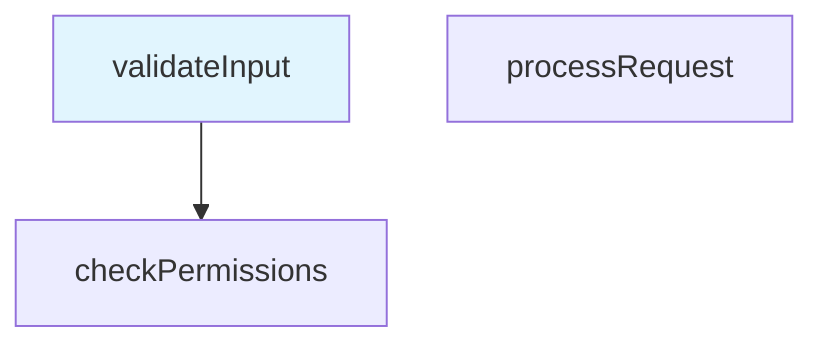

# Code Path Marker API 参考文档

本文档提供 Code Path Marker VS Code 扩展的 API 参考信息。

## 📚 目录

- [核心管理器](#核心管理器)
- [数据模型](#数据模型)
- [渲染器](#渲染器)
- [错误处理](#错误处理)
- [配置](#配置)

## 核心管理器

### GraphManager

管理图表生命周期操作，包括创建、加载、保存和删除。

### ClipboardManager

管理节点复制、粘贴和剪切操作。

#### 主要方法

##### `copyNode(nodeId: string): Promise<void>`

复制节点及其所有子节点到剪贴板。

**参数:**
- `nodeId`: 要复制的节点 ID。

**示例:**
```typescript
await clipboardManager.copyNode('node-123');
```

##### `cutNode(nodeId: string): Promise<void>`

剪切节点及其所有子节点到剪贴板。

**参数:**
- `nodeId`: 要剪切的节点 ID。

##### `pasteNode(parentId?: string): Promise<Node[]>`

从剪贴板粘贴节点树。

**参数:**
- `parentId` (可选): 目标父节点 ID。如果未提供，作为根节点粘贴。

**返回值:** 解析为粘贴的节点数组的 Promise。

### NodeOrderManager

管理节点在同级中的顺序。

#### 主要方法

##### `moveNodeUp(nodeId: string): Promise<boolean>`

将节点在同级中向上移动。

**参数:**
- `nodeId`: 要移动的节点 ID。

**返回值:** 如果移动成功返回 true，如果已在顶部返回 false。

##### `moveNodeDown(nodeId: string): Promise<boolean>`

将节点在同级中向下移动。

**参数:**
- `nodeId`: 要移动的节点 ID。

**返回值:** 如果移动成功返回 true，如果已在底部返回 false。

#### 构造函数

```typescript
constructor(
    storageManager: IStorageManager,
    configManager: IConfigurationManager
)
```

#### 主要方法

##### `createGraph(name?: string): Promise<Graph>`

创建带可选名称的新图表。

**参数:**
- `name` (可选): 图表名称。如果未提供，生成默认名称。

**返回值:** 解析为创建的 Graph 对象的 Promise。

**示例:**
```typescript
const graph = await graphManager.createGraph('用户认证流程');
```

##### `loadGraph(graphId: string): Promise<Graph>`

通过 ID 加载现有图表。

**参数:**
- `graphId`: 要加载的图表的唯一标识符。

**返回值:** 解析为加载的 Graph 对象的 Promise。

**抛出:** 如果图表未找到或损坏，抛出 `CodePathError`。

##### `exportGraph(graph: Graph, format: 'md'): Promise<string>`

将图表导出为指定格式。

**参数:**
- `graph`: 要导出的图表对象。
- `format`: 导出格式（目前仅支持 'md'）。

**返回值:** 解析为导出内容字符串的 Promise。

### NodeManager

管理节点创建、关系和导航。

#### 主要方法

##### `createNode(name: string, filePath: string, lineNumber: number, codeSnippet?: string): Promise<Node>`

创建新的根节点。

**参数:**
- `name`: 节点显示名称。
- `filePath`: 源文件的绝对路径。
- `lineNumber`: 源文件中的行号。
- `codeSnippet` (可选): 与节点关联的代码片段。

**返回值:** 解析为创建的 Node 对象的 Promise。

**示例:**
```typescript
const node = await nodeManager.createNode(
    'validateInput',
    '/src/auth.ts',
    15,
    'function validateInput(data: any) {'
);
```

##### `createChildNode(parentId: string, name: string, filePath: string, lineNumber: number): Promise<Node>`

在指定父节点下创建子节点。

**参数:**
- `parentId`: 父节点的 ID。
- `name`: 子节点显示名称。
- `filePath`: 源文件的绝对路径。
- `lineNumber`: 源文件中的行号。

**返回值:** 解析为创建的子 Node 对象的 Promise。

##### `setCurrentNode(nodeId: string): void`

设置当前活动节点。

**参数:**
- `nodeId`: 要设置为当前的节点 ID。

**抛出:** 如果节点未找到，抛出 `CodePathError`。

### PreviewManager

管理预览渲染和格式切换。

#### 主要方法

##### `renderPreview(): Promise<string>`

以选定格式渲染当前图表。

**返回值:** 解析为渲染内容字符串的 Promise。

##### `setFormat(format: 'text' | 'mermaid'): void`

设置预览格式。

**参数:**
- `format`: 预览格式（'text' 或 'mermaid'）。

##### `getFormat(): 'text' | 'mermaid'`

获取当前预览格式。

**返回值:** 当前预览格式。

## 数据模型

### Graph

表示包含节点及其关系的代码路径图表。

#### 属性

```typescript
interface Graph {
    /** 唯一图表标识符 */
    id: string;
    /** 人类可读的图表名称 */
    name: string;
    /** 图表创建时间戳 */
    createdAt: Date;
    /** 最后修改时间戳 */
    updatedAt: Date;
    /** 节点 ID 到 Node 对象的映射 */
    nodes: Map<string, Node>;
    /** 根节点 ID 数组 */
    rootNodes: string[];
    /** 当前选中的节点 ID */
    currentNodeId: string | null;
}
```

#### 方法

##### `addNode(node: Node): void`

向图表添加节点。

##### `removeNode(nodeId: string): void`

移除节点并更新关系。

##### `getNode(nodeId: string): Node | undefined`

通过 ID 获取节点。

### Node

表示代码路径图表中的单个节点。

#### 属性

```typescript
interface Node {
    /** 唯一节点标识符 */
    id: string;
    /** 节点显示名称 */
    name: string;
    /** 源文件路径 */
    filePath: string;
    /** 源文件中的行号 */
    lineNumber: number;
    /** 可选代码片段 */
    codeSnippet?: string;
    /** 节点创建时间戳 */
    createdAt: Date;
    /** 父节点 ID（根节点为 null） */
    parentId: string | null;
    /** 子节点 ID 数组 */
    childIds: string[];
}
```

## 渲染器

### TextRenderer

将图表渲染为层次化文本表示。

#### 方法

##### `render(graph: Graph): string`

将整个图表渲染为文本。

**参数:**
- `graph`: 要渲染的图表对象。

**返回值:** 图表的文本表示。

**示例输出:**
```
📁 我的代码路径图表 (3 个节点)
├── 🔵 validateInput (/src/auth.ts:15) [当前]
│   └── 🔵 checkPermissions (/src/auth.ts:25)
└── 🔵 processRequest (/src/api.ts:10)
```

### MermaidRenderer

将图表渲染为 Mermaid 图表。

#### 方法

##### `render(graph: Graph): string`

将图表渲染为 Mermaid 图表。

**参数:**
- `graph`: 要渲染的图表对象。

**返回值:** Mermaid 图表语法字符串。

**示例输出:**


## 错误处理

### CodePathError

CodePath 特定错误的自定义错误类。

#### 构造函数

```typescript
constructor(
    message: string,
    category: ErrorCategory,
    options?: {
        originalError?: Error;
        userMessage?: string;
        suggestedAction?: string;
        recoverable?: boolean;
    }
)
```

#### 属性

- `category`: 错误类别（'user', 'filesystem', 'validation', 'rendering'）
- `userMessage`: 用户友好的错误消息
- `suggestedAction`: 建议的恢复操作
- `recoverable`: 错误是否可恢复

#### 静态方法

##### `userError(message: string, suggestedAction?: string): CodePathError`

创建用户输入错误。

##### `filesystemError(message: string, originalError?: Error): CodePathError`

创建文件系统错误。

##### `validationError(message: string): CodePathError`

创建验证错误。

## 配置

### 配置选项

扩展支持以下配置选项：

```typescript
interface Configuration {
    /** 默认预览格式 */
    defaultView: 'text' | 'mermaid';
    /** 启用自动图表保存 */
    autoSave: boolean;
    /** 启动时自动加载上次使用的图表 */
    autoLoadLastGraph: boolean;
    /** 预览刷新间隔（毫秒） */
    previewRefreshInterval: number;
    /** 每个图表的最大节点数 */
    maxNodesPerGraph: number;
}
```

### ConfigurationManager

#### 方法

##### `getConfiguration(): Configuration`

获取当前配置。

##### `updateConfiguration<K extends keyof Configuration>(key: K, value: Configuration[K]): Promise<void>`

更新配置值。

## 使用示例

### 基本节点创建工作流

```typescript
// 初始化管理器
const storageManager = new StorageManager('/workspace');
const configManager = new ConfigurationManager();
const graphManager = new GraphManager(storageManager, configManager);
const nodeManager = new NodeManager(graphManager, configManager);

// 创建图表
const graph = await graphManager.createGraph('认证流程');

// 创建根节点
const rootNode = await nodeManager.createNode(
    'validateCredentials',
    '/src/auth.ts',
    10,
    'function validateCredentials(username: string, password: string) {'
);

// 创建子节点
const childNode = await nodeManager.createChildNode(
    rootNode.id,
    'checkDatabase',
    '/src/auth.ts',
    25
);
```

### 预览渲染

```typescript
const previewManager = new PreviewManager(configManager);

// 设置格式并渲染
previewManager.setFormat('mermaid');
const diagramContent = await previewManager.renderPreview();

// 切换到文本格式
previewManager.setFormat('text');
const textContent = await previewManager.renderPreview();
```

### 错误处理

```typescript
try {
    await nodeManager.createNode('', '/invalid/path', -1);
} catch (error) {
    if (error instanceof CodePathError) {
        console.log('类别:', error.category);
        console.log('用户消息:', error.userMessage);
        console.log('建议操作:', error.suggestedAction);
        
        if (error.recoverable) {
            // 尝试恢复
        }
    }
}
```

## 最佳实践

### 内存管理

- 组件销毁时始终释放事件监听器
- 使用管理器的 `dispose()` 方法清理资源
- 避免不必要地持有大对象的引用

### 错误处理

- 对所有扩展特定错误使用 `CodePathError`
- 提供有用的用户消息和恢复建议
- 记录详细的错误信息用于调试

### 性能

- 对频繁操作（如预览更新）使用防抖
- 对大图表实现懒加载
- 在生产环境中监控内存使用

---

*此 API 文档从 TypeScript 接口和 JSDoc 注释自动生成。有关最新信息，请参考源代码。*