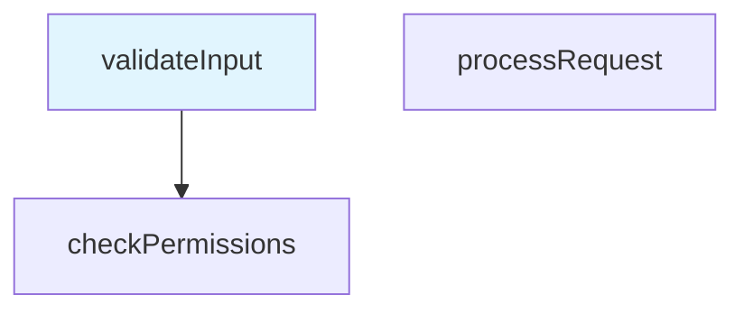

# CodePath - Visual Code Execution Path Tracker

CodePath is a powerful VS Code extension that helps developers visualize and track code execution paths through interactive node-based graphs. Create, manage, and navigate through your code flow with ease using both text and visual diagram representations.

## 🚀 Features

### Interactive Code Path Creation
- **Right-click Integration**: Create nodes directly from selected code with context menu
- **Automatic Capture**: File paths, line numbers, and code snippets are captured automatically
- **Hierarchical Relationships**: Build parent-child relationships between execution points
- **Smart Navigation**: Switch between nodes using fuzzy name matching or exact position

### Multiple Visualization Formats
- **Text View**: Clean hierarchical tree representation of your code paths
- **Mermaid Diagrams**: Visual flowcharts showing node relationships and execution flow
- **Real-time Updates**: Preview updates automatically as you modify your graph
- **Split-screen Layout**: Code and preview side-by-side for optimal workflow

### Graph Management
- **Multiple Graphs**: Create and switch between different code path scenarios
- **Export/Import**: Share graphs with team members via Markdown format
- **Auto-save**: Automatic persistence of your work with configurable intervals
- **Backup & Recovery**: Built-in backup system protects against data loss

### Developer Experience
- **Status Bar Integration**: Current graph and node information at a glance
- **Command Palette**: Full keyboard shortcut support for all operations
- **Configuration Options**: Customize default views, auto-save, and performance settings
- **Error Handling**: Graceful error recovery with helpful user messages

## 📋 Requirements

- **VS Code**: Version 1.74.0 or higher
- **Node.js**: Latest LTS version (for development)
- **Workspace**: A VS Code workspace or folder must be open

## 🛠️ Installation

1. Open VS Code
2. Go to Extensions (Ctrl+Shift+X)
3. Search for "CodePath"
4. Click Install
5. Reload VS Code when prompted

## 🎯 Quick Start

### Creating Your First Code Path

1. **Select Code**: Highlight any code in your editor
2. **Right-click**: Choose "New Node" from the context menu
3. **View Preview**: The CodePath panel opens automatically showing your node
4. **Add Children**: Select more code and choose "New Child Node" to build relationships
5. **Navigate**: Use "Switch Current Node" to jump between different execution points

### Basic Workflow

```
Select Code → Right-click → New Node → Build Relationships → Navigate & Visualize
```### Ke
yboard Shortcuts

| Action | Shortcut | Description |
|--------|----------|-------------|
| Open Panel | `Ctrl+Shift+C` | Show/hide CodePath preview panel |
| New Node | `Ctrl+Alt+N` | Create new root node from selection |
| New Child | `Ctrl+Alt+C` | Create child node under current node |
| New Parent | `Ctrl+Alt+P` | Create parent node above current node |
| Switch Node | `Ctrl+Alt+S` | Switch to different node |
| Switch Graph | `Ctrl+Shift+G` | Switch between graphs |
| Toggle Format | `Ctrl+Shift+T` | Switch between text and diagram view |
| Refresh | `Ctrl+Shift+R` | Refresh preview |

## ⚙️ Configuration

CodePath can be customized through VS Code settings:

### Available Settings

```json
{
  "codepath.defaultView": "text",              // Default preview format: "text" or "mermaid"
  "codepath.autoSave": true,                   // Enable automatic graph saving
  "codepath.autoLoadLastGraph": true,          // Load last used graph on startup
  "codepath.previewRefreshInterval": 1000,     // Preview update interval (ms)
  "codepath.maxNodesPerGraph": 100             // Maximum nodes per graph
}
```

### Accessing Settings

1. Open VS Code Settings (`Ctrl+,`)
2. Search for "CodePath"
3. Modify settings as needed

## 📖 Usage Guide

### Creating Nodes

#### Root Nodes
1. Select code text in any file
2. Right-click and choose "New Node"
3. A new graph is created automatically if none exists

#### Child Nodes
1. Ensure you have a current node selected
2. Select code for the child node
3. Right-click and choose "New Child Node"
4. The new node becomes a child of the current node

#### Parent Nodes
1. Select a node as the future child
2. Select code for the parent node
3. Right-click and choose "New Parent Node"
4. The relationship chain is rebuilt automatically

### Navigation

#### Fuzzy Name Matching
- Use "Switch Current Node" command
- Type partial node name (e.g., "validate" matches "validateUserInput")
- Select from the filtered list

#### Position Matching
- Use format: `filename:line` (e.g., `/src/auth.ts:15`)
- Exact file path and line number matching
- Useful for jumping to specific code locations

### Graph Management

#### Creating Graphs
1. Use Command Palette (`Ctrl+Shift+P`)
2. Type "CodePath: Create New Graph"
3. Enter a descriptive name
4. Start adding nodes to the new graph

#### Switching Graphs
1. Use `Ctrl+Shift+G` or Command Palette
2. Select from available graphs
3. Preview updates automatically

#### Export/Import
- **Export**: Command Palette → "CodePath: Export Graph"
- **Import**: Command Palette → "CodePath: Import Graph"
- **Format**: Markdown files with embedded graph data

### Preview Formats

#### Text View
```
📁 My Code Path Graph (3 nodes)
├── 🔵 validateInput (/src/auth.ts:15) [CURRENT]
│   └── 🔵 checkPermissions (/src/auth.ts:25)
└── 🔵 processRequest (/src/api.ts:10)
```

#### Mermaid Diagram View


## 🔧 Advanced Features

### Auto-save Configuration
- Graphs are automatically saved every 5 minutes by default
- Configure interval in settings: `codepath.previewRefreshInterval`
- Disable with: `"codepath.autoSave": false`

### Performance Optimization
- Recommended limit: 100 nodes per graph
- Large graphs use segmented loading
- Preview rendering has 5-second timeout
- Memory usage monitored automatically

### Error Recovery
- Automatic backup every 5 minutes
- Corrupted file recovery from backups
- Graceful handling of missing files
- User-friendly error messages with recovery suggestions

### Workspace Integration
- Graphs stored in `.codepath/` directory
- Automatic workspace detection
- Cross-platform file path handling
- Git-friendly storage format

## 🐛 Troubleshooting

### Common Issues

#### "Please select code text first"
- **Cause**: No text selected when creating node
- **Solution**: Highlight code before right-clicking

#### "No current node selected"
- **Cause**: Trying to create child/parent without current node
- **Solution**: Switch to a node first or create a root node

#### Preview not updating
- **Cause**: Preview refresh interval too high or rendering error
- **Solution**: Use `Ctrl+Shift+R` to force refresh or check error messages

#### Graph not loading on startup
- **Cause**: Auto-load disabled or corrupted graph file
- **Solution**: Enable auto-load in settings or manually switch graphs

### Performance Issues

#### Slow preview updates
- **Cause**: Graph too large or complex Mermaid diagrams
- **Solution**: Reduce node count or switch to text view

#### High memory usage
- **Cause**: Multiple large graphs loaded
- **Solution**: Close unused graphs or restart VS Code

### File System Issues

#### Permission denied errors
- **Cause**: Insufficient file system permissions
- **Solution**: Check workspace permissions or run VS Code as administrator

#### Workspace not found
- **Cause**: No folder/workspace open in VS Code
- **Solution**: Open a folder or workspace before using CodePath

## 🤝 Contributing

We welcome contributions! Please see our [Contributing Guide](CONTRIBUTING-EN.md) for details.

### Development Setup

1. Clone the repository
2. Run `npm install`
3. Open in VS Code
4. Press `F5` to launch Extension Development Host
5. Make changes and test

### Running Tests

```bash
# Unit tests
npm run test:unit

# Integration tests
npm run test:unit -- src/integration/

# All tests with coverage
npm run test:unit -- --coverage
```

## 📄 License

This project is licensed under the MIT License - see the [LICENSE](LICENSE) file for details.

## 🆘 Support

- **Issues**: [GitHub Issues](https://github.com/your-org/codepath-extension/issues)
- **Discussions**: [GitHub Discussions](https://github.com/your-org/codepath-extension/discussions)
- **Documentation**: [Wiki](https://github.com/your-org/codepath-extension/wiki)

## 🎉 Acknowledgments

- VS Code Extension API team for excellent documentation
- Mermaid.js for diagram rendering capabilities
- The open-source community for inspiration and feedback

---

**Happy Code Tracking! 🚀**

*CodePath helps you understand your code flow like never before. Start visualizing your execution paths today!*