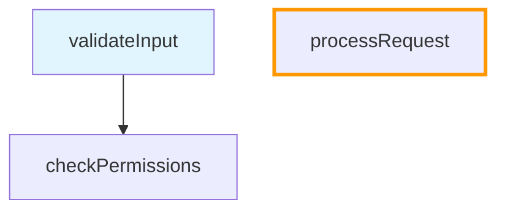

# CodePath - 可视化代码执行路径追踪器

CodePath 是一个 VS Code 扩展，帮助开发者通过交互式节点图表可视化和追踪代码执行路径。支持创建、管理和导航代码流程，提供文本和可视化图表两种展示方式。

## 🚀 功能特性

### 交互式代码路径创建
- **右键集成**: 直接从选中代码通过上下文菜单创建节点
- **自动捕获**: 自动捕获文件路径、行号和代码片段
- **层次关系**: 在执行点之间建立父子关系
- **智能导航**: 使用模糊匹配或精确位置切换节点
- **节点编辑**: 实时编辑节点信息，自动验证和更新预览
- **描述支持**: 为节点添加多行描述，支持斜体格式显示

### 智能位置追踪
- **自动检测变化**: 实时检测代码位置变化并提示更新
- **多层搜索策略**: 精确匹配、邻近搜索、全文搜索、模糊匹配
- **用户确认更新**: 点击 OK 后自动更新节点位置、行号和代码片段
- **即时预览刷新**: 更新后预览立即刷新，无需切换节点
- **代码指纹技术**: 使用 SHA-256 哈希确保精确追踪
- **置信度评估**: exact、high、medium、low 四级置信度
- **容错导航**: 即使验证失败也能导航到原始位置

### 树分叉功能
- **多路径追踪**: 为已有父节点的节点添加新父节点时自动创建分叉
- **保留原关系**: 原有父子关系完整保留
- **子孙转移**: 所有子孙节点自动转移到新分支
- **场景探索**: 支持追踪同一代码位置的多条执行路径

### 多种可视化格式
- **文本视图**: 清晰的层次树状代码路径表示，简化文件名显示
- **Mermaid 图表**: 显示节点关系和执行流程的可视化流程图
- **实时更新**: 修改图表时预览自动更新
- **分屏布局**: 代码和预览并排显示，优化工作流程
- **格式切换**: 一键在文本和图表视图之间切换

### CodePath 管理
- **多 CodePath**: 创建和切换不同的代码路径场景
- **自动切换**: 新建图表后自动切换并更新 UI
- **导出/导入**: 通过 Markdown 格式与团队成员分享 CodePath
- **导入自动切换**: 导入后自动切换到新图表并导航到当前节点
- **文件浏览器集成**: 右键 `.codepath/*.json` 文件直接预览或分享
- **一键导出**: 预览面板工具栏直接导出当前图表
- **文件分享**: 复制图表文件到剪贴板（Windows/macOS）或路径（Linux）
- **自动保存**: 可配置间隔的工作自动持久化
- **备份恢复**: 内置备份系统防止数据丢失

### 开发者体验
- **状态栏快捷菜单**: 点击状态栏图标快速访问所有 CodePath 管理功能
- **一键操作**: 新建、切换、导出、导入、删除 CodePath，无需记忆命令
- **实时信息**: 一目了然的当前 CodePath 和节点信息
- **命令面板**: 所有操作的完整键盘快捷键支持
- **配置选项**: 自定义默认视图、自动保存和性能设置
- **错误处理**: 优雅的错误恢复和有用的用户消息
- **启动自动加载**: 打开 VS Code 时自动加载上次使用的图表并显示预览

## 📋 系统要求

- **VS Code**: 版本 1.74.0 或更高
- **Node.js**: 最新 LTS 版本（用于开发）
- **工作区**: 必须在 VS Code 中打开工作区或文件夹

## 🛠️ 安装

1. 打开 VS Code
2. 转到扩展 (Ctrl+Shift+X)
3. 搜索 "CodePath"
4. 点击安装
5. 提示时重新加载 VS Code

## 🎯 快速开始

### 创建你的第一个代码路径

1. **选择代码**: 在编辑器中高亮任意代码
2. **右键点击**: 从上下文菜单选择 "New Node"
3. **查看预览**: CodePath 面板自动打开显示你的节点
4. **添加子节点**: 选择更多代码并选择 "New Child Node" 来建立关系
5. **导航**: 使用 "Switch Current Node" 在不同执行点间跳转
6. **编辑节点**: 点击节点后选择 "Edit Node" 修改信息
7. **位置追踪**: 代码移动后系统自动提示更新位置

### 使用状态栏快捷菜单

CodePath 在 VS Code 左下角状态栏提供了一个便捷的快捷菜单：

1. **点击状态栏**: 点击显示 `$(graph) CodePath 名称 (节点数)` 的状态栏项
2. **选择操作**: 从弹出菜单中选择你需要的操作：
   - 🆕 **新建 CodePath** - 创建一个新的 CodePath（自动切换）
   - 🔄 **切换 CodePath** - 在不同 CodePath 之间快速切换
   - 📤 **导出 CodePath** - 将当前 CodePath 导出为 Markdown 文件
   - 📥 **导入 CodePath** - 从 Markdown 文件导入 CodePath（自动切换和导航）
   - 🗑️ **删除 CodePath** - 删除不需要的 CodePath
   - 🔄 **刷新预览** - 手动刷新预览面板
   - 🎯 **切换节点** - 快速跳转到其他节点
   - 👁️ **切换视图格式** - 在文本和图表视图之间切换

这是最快捷的 CodePath 管理方式，无需记忆任何命令或快捷键！

### 使用文件浏览器功能

在文件浏览器中管理 CodePath 文件：

1. **预览图表**: 右键 `.codepath/*.json` 文件 → "预览 CodePath"
   - 自动切换到该图表并打开预览
2. **分享图表**: 右键 `.codepath/*.json` 文件 → "分享 CodePath"
   - Windows/macOS: 文件复制到剪贴板，可直接粘贴到聊天工具
   - Linux: 文件路径复制到剪贴板

### 基本工作流程

```
选择代码 → 右键点击 → 新建节点 → 建立关系 → 导航和可视化 → 编辑和追踪
```### 键盘快捷键

| 操作 | 快捷键 | 描述 |
|------|--------|------|
| 打开面板 | `Ctrl+Shift+C` | 显示/隐藏 CodePath 预览面板 |
| 新建节点 | `Ctrl+Alt+N` | 从选择创建新的根节点 |
| 新建子节点 | `Ctrl+Alt+C` | 在当前节点下创建子节点（可能创建分叉） |
| 新建父节点 | `Ctrl+Alt+P` | 在当前节点上创建父节点（可能创建分叉） |
| 切换节点 | `Ctrl+Alt+S` | 切换到不同节点（支持模糊搜索） |
| 切换 CodePath | `Ctrl+Shift+G` | 在 CodePath 间切换 |
| 切换格式 | `Ctrl+Shift+T` | 在文本和图表视图间切换 |
| 刷新 | `Ctrl+Shift+R` | 刷新预览（重新验证所有节点） |

**提示**: 大多数操作也可以通过点击状态栏 CodePath 图标快速访问！

## ⚙️ 配置

CodePath 可以通过 VS Code 设置进行自定义：

### 可用设置

```json
{
  "codepath.defaultView": "text",              // 默认预览格式: "text" 或 "mermaid"
  "codepath.autoSave": true,                   // 启用自动图表保存
  "codepath.autoLoadLastGraph": true,          // 启动时加载上次使用的图表
  "codepath.previewRefreshInterval": 1000,     // 预览更新间隔 (毫秒)
  "codepath.maxNodesPerGraph": 100             // 每个图表的最大节点数
}
```

### 访问设置

1. 打开 VS Code 设置 (`Ctrl+,`)
2. 搜索 "CodePath"
3. 根据需要修改设置

## 📖 使用指南

### 创建节点

#### 根节点
1. 在任意文件中选择代码文本
2. 右键点击并选择 "New Node"
3. 如果不存在图表会自动创建新图表

#### 子节点
1. 确保已选择当前节点
2. 选择子节点的代码
3. 右键点击并选择 "New Child Node"
4. 新节点成为当前节点的子节点

#### 父节点
1. 选择一个节点作为未来的子节点
2. 选择父节点的代码
3. 右键点击并选择 "New Parent Node"
4. 如果子节点已有父节点，系统会自动创建树分叉
5. 原有关系保留，新关系形成独立分支

### 编辑节点

#### 编辑节点信息
1. 点击节点导航到代码位置
2. 在预览面板点击 "Edit Node" 按钮
3. 修改节点名称、文件路径、行号、代码片段或描述
4. 点击 "保存" 按钮
5. 系统自动验证位置并更新预览

#### 添加描述
1. 编辑节点时在描述框输入文本
2. 支持多行描述
3. 描述会以灰色斜体显示在预览中
4. 描述不影响节点功能，仅用于说明

### 智能位置追踪

#### 自动检测位置变化
1. 修改代码后，节点位置可能发生变化
2. 点击节点时系统自动检测位置
3. 如果检测到变化，显示警告提示：
   ```
   ⚠️ Code location may have changed: Code found at line 124 (moved 2 lines)
   [OK] [Dismiss]
   ```
4. 点击 "OK" 自动更新节点位置
5. 点击 "Dismiss" 保持原位置

#### 搜索策略
系统使用多层搜索策略找到移动的代码：
1. **精确匹配**: 使用 SHA-256 代码哈希
2. **邻近搜索**: 在原位置 ±20 行范围内搜索
3. **全文搜索**: 搜索整个文件
4. **模糊匹配**: 使用 Levenshtein 距离算法

#### 置信度级别
- **exact**: 精确匹配（哈希相同）
- **high**: 高置信度（相似度>95%或距离≤5行）
- **medium**: 中等置信度（相似度>85%或距离≤10行）
- **low**: 低置信度（相似度>80%）

### 树分叉功能

#### 创建分叉
1. 选择一个已有父节点的节点
2. 为其创建新的父节点
3. 系统自动创建分叉：
   - 原节点保留在原分支
   - 创建节点副本到新分支
   - 所有子孙节点转移到新分支

#### 使用场景
- 追踪同一函数的不同调用路径
- 探索不同的执行场景
- 记录多种可能的代码流程

### 导航

#### 模糊名称匹配
- 使用 "Switch Current Node" 命令
- 输入部分节点名称（例如 "validate" 匹配 "validateUserInput"）
- 从过滤列表中选择

#### 位置匹配
- 使用格式: `filename:line` (例如 `/src/auth.ts:15`)
- 精确文件路径和行号匹配
- 用于跳转到特定代码位置

### CodePath 管理

#### 创建 CodePath
1. 点击状态栏 CodePath 图标 → "新建 CodePath"
2. 或使用命令面板 (`Ctrl+Shift+P`) → "CodePath: Create New CodePath"
3. 输入描述性名称（可选，留空使用默认名称）
4. 系统自动切换到新 CodePath 并更新预览
5. 开始向新 CodePath 添加节点

#### 切换 CodePath
1. 点击状态栏 CodePath 图标 → "切换 CodePath"
2. 或使用快捷键 `Ctrl+Shift+G`
3. 从可用 CodePath 列表中选择
4. 预览自动更新显示新图表

#### 导出 CodePath
**方式 1: 状态栏菜单**
1. 点击状态栏 CodePath 图标 → "导出 CodePath"
2. 选择保存位置
3. 生成 Markdown 文件

**方式 2: 预览面板**
1. 在预览面板点击 "📤 Export" 按钮
2. 选择保存位置
3. 生成 Markdown 文件

**方式 3: 文件浏览器**
1. 在文件浏览器找到 `.codepath/*.json` 文件
2. 右键 → "分享 CodePath"
3. Windows/macOS: 文件复制到剪贴板，可直接粘贴
4. Linux: 文件路径复制到剪贴板

#### 导入 CodePath
1. 点击状态栏 CodePath 图标 → "导入 CodePath"
2. 或使用命令面板 → "CodePath: Import CodePath"
3. 选择要导入的 .md 文件
4. 系统自动：
   - 导入图表数据
   - 切换到新图表
   - 打开预览面板
   - 如果有当前节点，自动导航到该位置

#### 预览 CodePath 文件
1. 在文件浏览器找到 `.codepath/*.json` 文件
2. 右键 → "预览 CodePath"
3. 系统自动切换到该图表并打开预览

#### 删除 CodePath
1. 点击状态栏 CodePath 图标 → "删除 CodePath"
2. 从列表中选择要删除的图表
3. 确认删除操作
4. 图表文件被永久删除

### 预览格式

#### 文本视图
```
📁 我的代码路径图表 (3 个节点)
├── 🔵 validateInput (auth.ts:15) [当前]
│   │   <描述信息以灰色斜体显示>
│   └── 🔵 checkPermissions (auth.ts:25)
└── ⚠️ processRequest (api.ts:10)
    │   <位置可能已变化>
```

**显示特性**:
- 简化文件名显示（只显示文件名，不显示完整路径）
- 当前节点标记 `[当前]`
- 位置警告标记 `⚠️`
- 描述信息以灰色斜体显示
- 支持多行描述

#### Mermaid 图表视图


**显示特性**:
- 当前节点高亮显示（浅蓝色背景）
- 警告节点橙色边框
- 清晰的节点关系箭头
- 自动布局优化

## 🔧 高级功能

### 自动保存配置
- 默认每 5 分钟自动保存图表
- 在设置中配置间隔: `codepath.previewRefreshInterval`
- 禁用: `"codepath.autoSave": false`

### 性能优化
- 推荐限制: 每个图表 100 个节点
- 大图表使用分段加载
- 预览渲染有 5 秒超时
- 自动监控内存使用

### 错误恢复
- 每 5 分钟自动备份
- 从备份恢复损坏文件
- 优雅处理缺失文件
- 带有恢复建议的用户友好错误消息

### 工作区集成
- 图表存储在 `.codepath/` 目录
- 自动工作区检测
- 跨平台文件路径处理
- Git 友好的存储格式

### 智能代码追踪
- **代码指纹**: 使用 SHA-256 哈希生成代码指纹
- **多策略搜索**: 精确匹配 → 邻近搜索 → 全文搜索 → 模糊匹配
- **置信度评估**: 根据匹配质量提供不同级别的置信度
- **自动更新**: 用户确认后自动更新节点位置和代码片段
- **即时刷新**: 更新后预览立即刷新，无需手动操作

### 树分叉管理
- **自动检测**: 系统自动检测是否需要创建分叉
- **关系保留**: 原有父子关系完整保留
- **子树转移**: 所有子孙节点自动转移到新分支
- **独立管理**: 分叉后的节点可以独立编辑和管理

### 文件浏览器集成
- **快速预览**: 右键 JSON 文件直接预览图表
- **一键分享**: 复制文件到剪贴板（Windows/macOS）
- **路径分享**: 复制文件路径（Linux）
- **自动切换**: 预览时自动切换到对应图表

### 节点编辑和验证
- **实时编辑**: 在预览面板直接编辑节点信息
- **自动验证**: 保存后自动验证位置是否正确
- **即时反馈**: 验证结果立即显示在预览中
- **警告管理**: 自动添加或清除位置警告标记

## 🐛 故障排除

### 常见问题

#### "请先选择代码文本"
- **原因**: 创建节点时没有选择文本
- **解决方案**: 右键点击前先高亮代码

#### "没有选择当前节点"
- **原因**: 尝试创建子/父节点但没有当前节点
- **解决方案**: 先切换到一个节点或创建根节点

#### 预览不更新
- **原因**: 预览刷新间隔太高或渲染错误
- **解决方案**: 使用 `Ctrl+Shift+R` 强制刷新或检查错误消息

#### 启动时 CodePath 不加载
- **原因**: 自动加载被禁用或 CodePath 文件损坏
- **解决方案**: 在设置中启用自动加载或手动切换 CodePath

#### 节点显示 ⚠️ 警告
- **原因**: 代码位置发生变化，系统检测到不匹配
- **解决方案**: 
  1. 点击节点，系统会尝试导航到原位置
  2. 点击 "Edit Node" 按钮修改位置信息
  3. 或点击节点时选择 "OK" 自动更新位置

#### 编辑节点后警告不消失
- **原因**: 修改的位置信息仍然不正确
- **解决方案**: 
  1. 确保修改的行号和代码片段与实际代码匹配
  2. 检查文件路径是否正确
  3. 保存后系统会自动重新验证

#### 导入后无法导航到节点
- **原因**: 导入的图表中的文件路径在本地不存在
- **解决方案**: 
  1. 检查文件是否存在于工作区
  2. 使用 "Edit Node" 修改文件路径
  3. 或重新创建节点指向正确的文件

#### 树分叉后节点重复
- **原因**: 这是正常行为，用于追踪多条执行路径
- **说明**: 
  - 原节点保留在原分支
  - 副本节点在新分支
  - 两个节点独立管理，可以有不同的子节点

### 性能问题

#### 预览更新缓慢
- **原因**: 图表太大或复杂的 Mermaid 图表
- **解决方案**: 减少节点数量或切换到文本视图

#### 内存使用过高
- **原因**: 加载了多个大图表
- **解决方案**: 关闭未使用的图表或重启 VS Code

### 文件系统问题

#### 权限被拒绝错误
- **原因**: 文件系统权限不足
- **解决方案**: 检查工作区权限或以管理员身份运行 VS Code

#### 找不到工作区
- **原因**: VS Code 中没有打开文件夹/工作区
- **解决方案**: 使用 CodePath 前先打开文件夹或工作区

## 🌟 新功能亮点

### 智能位置追踪 (v0.1.0+)

当你重构代码或移动函数时，CodePath 会自动检测位置变化：

**工作流程**:
1. 修改代码，移动函数位置
2. 点击节点时系统自动检测
3. 显示提示：`⚠️ Code location may have changed: Code found at line 124 (moved 2 lines)`
4. 点击 "OK" 自动更新节点位置
5. 预览立即刷新，警告消失

**技术特性**:
- SHA-256 代码指纹技术
- 4 层搜索策略（精确 → 邻近 → 全文 → 模糊）
- 4 级置信度评估（exact, high, medium, low）
- 即时预览更新

### 树分叉功能 (v0.1.0+)

追踪同一代码的多条执行路径：

**使用场景**:
```
原始结构:
root → child → grandchild

为 child 添加新父节点 newParent 后:
├─ newParent → child → grandchild  (新分支)
└─ root → child                     (原分支)
```

**特性**:
- 自动检测并创建分叉
- 保留原有关系
- 子树自动转移
- 独立管理分支

### 节点编辑和验证 (v0.1.0+)

实时编辑节点信息，自动验证位置：

**功能**:
- 编辑名称、路径、行号、代码片段
- 添加多行描述（支持斜体格式）
- 保存后自动验证位置
- 即时更新预览和警告状态

**用户体验**:
- 点击节点 → Edit Node → 修改 → 保存 → 自动验证 → 预览更新

### 文件浏览器集成 (v0.1.0+)

直接从文件浏览器管理图表：

**预览功能**:
- 右键 `.codepath/*.json` → "预览 CodePath"
- 自动切换到该图表
- 打开预览面板

**分享功能**:
- 右键 `.codepath/*.json` → "分享 CodePath"
- Windows/macOS: 文件复制到剪贴板
- Linux: 文件路径复制到剪贴板
- 可直接粘贴到聊天工具或文件夹

### 导入自动切换 (v0.1.0+)

导入图表后自动切换和导航：

**工作流程**:
1. 导入 Markdown 文件
2. 自动切换到新图表
3. 打开预览面板
4. 如果有当前节点，自动导航到代码位置

**优势**:
- 无缝导入体验
- 立即可用
- 自动上下文恢复

### 预览面板导出 (v0.1.0+)

直接从预览面板导出图表：

**使用方式**:
- 点击预览面板工具栏的 "📤 Export" 按钮
- 选择保存位置
- 生成 Markdown 文件

**优势**:
- 更快捷的操作
- 无需打开菜单
- 一键导出

## 🤝 贡献

我们欢迎贡献！请查看我们的 [贡献指南](CONTRIBUTING-ZH.md) 了解详情。

### 开发设置

1. 克隆仓库
2. 运行 `npm install`
3. 在 VS Code 中打开
4. 按 `F5` 启动扩展开发主机
5. 进行更改和测试

### 运行测试

```bash
# 单元测试
npm run test:unit

# 集成测试
npm run test:unit -- src/integration/

# 带覆盖率的所有测试
npm run test:unit -- --coverage
```

## 📄 许可证

本项目基于 MIT 许可证 - 查看 [LICENSE](LICENSE) 文件了解详情。

## 🆘 支持

- **问题**: [GitHub Issues](https://github.com/your-org/codepath-extension/issues)
- **讨论**: [GitHub Discussions](https://github.com/your-org/codepath-extension/discussions)
- **文档**: [Wiki](https://github.com/your-org/codepath-extension/wiki)

## 🎉 致谢

- VS Code 扩展 API 团队提供的优秀文档
- Mermaid.js 提供的图表渲染功能
- 开源社区的灵感和反馈

---

**愉快的代码追踪！ 🚀**

*CodePath 帮助你前所未有地理解代码流程。今天就开始可视化你的执行路径吧！*